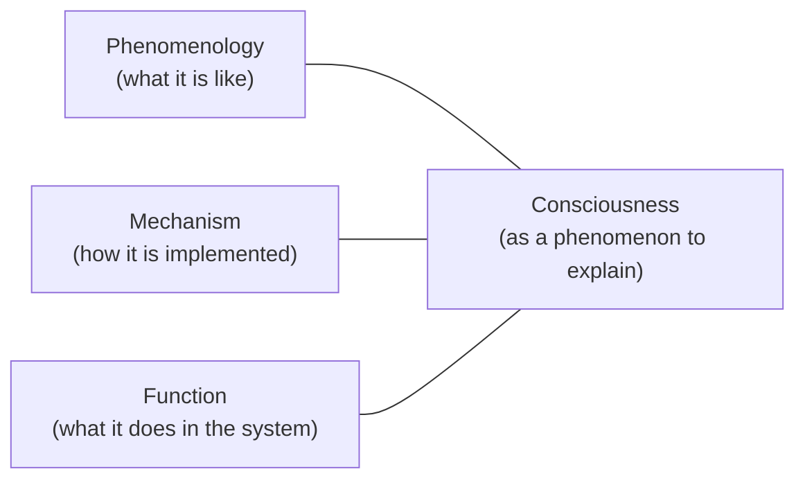

# Chapter 1: The Project (Mind as a Mechanism)

## Motivation / puzzle
[BACH] Artificial intelligence is not only an engineering project. It is also a philosophical project: it asks what kind of thing a mind is, what it means to know or understand, and whether consciousness can exist in a machine. <!-- src: yt_DYm7VBaEmHU @ 00:03:18 -->

[BACH] Consciousness matters because it is a gap in the scientific worldview. It matters culturally because it shapes how people locate themselves in reality. It matters ethically because non-human agency forces questions about rights, responsibility, and the treatment of future minds. It matters medically because understanding mind is inseparable from understanding and alleviating suffering. <!-- src: yt_DYm7VBaEmHU @ 00:03:18 -->

[BACH] The puzzle that motivates this book is not simply "can we build systems that talk or reason?" We already can build systems that perform impressive fragments of reasoning. The puzzle is: how can a physical mechanism instantiate a point of view? How can a self-organizing system not only model the world, but also discover itself inside that model and experience itself as being confronted with a present? <!-- src: yt_UkAOHrbcnAs @ 00:16:47 -->

[BACH] The stance taken here is radical in rhetoric but conservative in ontology: mind is not a second substance added to physics. A mind is a functional organization, realized by mechanisms, that builds models and uses them for control. If this is correct, then the deep questions about mind become architectural questions. <!-- src: yt_UkAOHrbcnAs @ 00:16:47 -->

[BACH] This also forces a methodological discipline: consciousness cannot be settled by a single observational angle. One needs triangulation. <!-- src: yt_DYm7VBaEmHU @ 00:05:14 -->

[BACH] In particular, consciousness is not treated as a benchmark property. There is no straightforward Turing test for it: performance can be achieved by many internal organizations, and consciousness is a particular way a system is organized and relates to itself. This makes consciousness a matter of interpretation of internal structure, not a score. <!-- src: yt_DYm7VBaEmHU @ 00:20:01 -->

## Definitions introduced or refined
[BACH] <!-- src: yt_DYm7VBaEmHU @ 00:03:18 -->
- Naturalizing the mind: treating mind as part of the causal fabric of the world, explainable by mechanisms that implement functions.
- Model: a constructed structure that supports prediction and control; not a copy of reality.
- Representation: an internal structure that stands in for something else and supports inference for control.
- Agent: a control system that uses models to choose actions under constraints.
- Control: closed-loop regulation under feedback, not domination.
- Consciousness: a functional organization that stabilizes and coordinates mental contents into a coherent point of view (working definition for this book).
- Coherence: a control-relevant agreement among subsystems that allows the system to act as one agent rather than as competing local processes.
- Self-organization: a process in which the system's structure is produced and maintained by its own dynamics rather than being fully specified externally.
- Computationalist functionalism: a philosophical backbone for AI and cognitive modeling.
  - Functionalism (usage tracked here): objects are constructed over observations; an object is defined by the functional differences its presence makes.
  - Computationalism (usage tracked here): models are realized constructively in an implementable representational language.
- Triangulation discipline: for mind and consciousness, keep three perspectives distinct:
  - Phenomenology: what it is like.
  - Mechanism: how it is implemented.
  - Function: what it does in the system.

[SYNTH] This book uses "mind" as an engineering term: a name for a class of systems. It does not use "mind" as an honorific ("minds are special") or as a supernatural placeholder ("minds are beyond mechanism").

## How to Read This Book (Method)
[SYNTH] The primary failure mode of writing about mind is category drift: a definition shifts by a few degrees in each chapter until the reader no longer knows what is being claimed. This book tries to avoid that by repeating a discipline: define terms as roles in an architecture, keep levels of explanation separate, and cash out abstractions in concrete control loops and examples.

[SYNTH] A second failure mode is attribution drift: the author silently imports improvements from adjacent frameworks and then attributes the improved version to the subject. The present approach is stricter: where the text restates the sources, it aims to do so precisely and points to source anchors (URLs + timecodes). Where the text makes a bridge or extrapolation, it should be readable as such.

[SYNTH] The standard for explanations in the exposition (especially when the text is doing synthesis rather than restatement) is "good explanations" in Deutsch's sense: explanations should be hard to vary while still accounting for the same phenomena, and they should expose consequences that can, in principle, be tested against experience (including the experience of building or analyzing systems).

[NOTE] The goal is not to collect transcripts. The goal is to collect ideas: primitives, distinctions, and implications. Transcripts are evidence; the book is the model built from that evidence.

## Model (function + mechanism + phenomenology)
[BACH] Function: a mind is what turns a substrate into an agent. It exists to control the future under uncertainty: to keep the system inside viability constraints while extending its degrees of freedom. Control of the future entails making models. Better models make better control possible. <!-- src: yt_CcQMYNi9a2w @ 00:47:45 -->

[BACH] A key move is to treat "knowledge" as control-relevant structure. A model is not "true" because it mirrors reality; it is good because it supports successful prediction and regulation under the system's constraints. <!-- src: yt_UkAOHrbcnAs @ 00:16:47 -->

[BACH] Mechanism: the functional description does not commit to a specific substrate. Brains implement minds through self-organization in biology. Computers implement causal structures through engineered computation. If the relevant organization can be implemented, the function can exist on new substrates. <!-- src: yt_DYm7VBaEmHU @ 00:03:18 -->

[BACH] The philosophical backbone often called computationalist functionalism can be read as a claim about how minds construct objects. Objects in the mind do not reveal themselves by magic. They are constructed from observations and constraints: an object is defined by how its presence changes the course of reality in the model. <!-- src: yt_DYm7VBaEmHU @ 00:03:18 -->

[BACH] This is one reason why "what the mind does" is prior to "what the mind is made of" in this framing. The mind's ontology is not a list of substances; it is a list of roles in a causal organization. If two different substrates realize the same role-structure at the relevant level of description, they realize the same kind of object. <!-- src: yt_DYm7VBaEmHU @ 00:03:18 -->

[SYNTH] This does not imply that implementation is irrelevant. Implementation constrains which organizations are realizable, what they cost, and which failure modes dominate. But it implies that the core explanatory targets (model building, control, valence, self-modeling, consciousness) should be stated first as functional roles.

[BACH] Phenomenology: the mind does not merely compute; it experiences. The hardest part is not to assert that experience exists, but to connect experience to a functional organization without collapsing it into either metaphysics ("experience is fundamental") or reductionist slogans ("experience is an illusion"). The claim is that experience is what the system is like to itself when it stabilizes a point of view. <!-- src: yt_DYm7VBaEmHU @ 00:03:18 -->

[NOTE] We use history only as compression: it situates the project as part of a long line of attempts to close gaps between philosophy, mathematics, and engineering. In the cited talks, historical references typically serve as conceptual lineage (these ideas are not new), credibility (they have been worked on for a long time), and optional further reading (if the reader wants to trace the ancestry).

### Historical compression (lineage of the project)
[BACH] AI is framed as the latest phase of an older attempt: to naturalize mind by turning it into something that can be described precisely and built. This is why the material moves fluidly between philosophy, computation, and cognitive science: the project is older than any single discipline. <!-- src: yt_DYm7VBaEmHU @ 00:03:18 -->

[BACH] Aristotle is used as an early exemplar of a non-dualist framing: the psyche is an organizing principle of living matter, not a separable immortal entity. The soul is a causal pattern that reproduces itself by building and maintaining the body that implements it. In modern language: the mind is an organization realized by mechanisms. <!-- src: yt_DYm7VBaEmHU @ 00:04:07 -->

[BACH] Leibniz is used as a proto-computationalist: discourse can, in principle, be made formal and evaluated by arithmetic. In this framing, this is not a quaint historical curiosity; it anticipates the idea that language-like competence can emerge from formal symbol manipulation and statistical structure, including the way modern LLMs can behave like discourse engines. <!-- src: yt_DYm7VBaEmHU @ 00:04:41 -->

[BACH] La Mettrie is used to dissolve a common straw man: "humans are machines" does not require gears and cogs. Humans can be abstract machines: causal organizations pushed and pulled by competing constraints, with motivation implemented as a dynamic balance of control signals. <!-- src: yt_DYm7VBaEmHU @ 00:05:14 -->

[BACH] Wittgenstein is used to highlight an enduring methodological problem: natural language is too ambiguous for reliable truth-tracking, while mathematics can be too narrow to capture lived reality. Closing the gap requires turning our descriptive language into something like a programming language: precise enough to build models, rich enough to talk about the world we actually inhabit. This ambition anticipates symbolic AI, and, in this framing, also anticipates why purely symbolic AI struggled (symbol grounding, brittleness). <!-- src: yt_DYm7VBaEmHU @ 00:05:37 -->

[BACH] Cybernetics (Wiener) is invoked as a control-centric bridge: minds can be described as feedback systems. Computer architecture (von Neumann) is invoked as the practical substrate for building arbitrary causal structures at scale, which makes "building minds" an engineering possibility rather than a purely philosophical speculation. <!-- src: yt_DYm7VBaEmHU @ 00:07:04 -->

[BACH] Turing is invoked as the first person to propose a pragmatic test for intelligence via discourse (the Turing test). This is used to make a contrast: a test for intelligence is about performance; consciousness is about organization and self-relation, so there is no clean behavioral Turing test for it. <!-- src: yt_DYm7VBaEmHU @ 00:20:01 -->

[BACH] The founding move of AI as a field (Minsky/McCarthy and others) can then be read as explicitly philosophical: teach machines to think to understand what thinking is. In this framing, the project is still unfinished because the mind remains under-theorized as an architecture that can be built and interpreted. <!-- src: yt_DYm7VBaEmHU @ 00:03:18 -->

## Worked example
[NOTE] A person is driving to a time-sensitive meeting in city traffic.

- Mechanism: sensorimotor loops (vision → steering/brake) keep lane position and spacing stable.
- Function: regulate the future under constraints (arrive, stay safe, obey norms) by selecting actions that keep error bounded.
- Phenomenology: the road is present as a world, the car feels like "mine", and urgency colors attention and choice.

[NOTE] We keep these lenses distinct while building the stack that makes this scene possible.

## Predictions / implications
[SYNTH]
- If mind is a functional organization, the central question becomes architectural: which organizations yield which properties (learning, agency, consciousness)?
- If consciousness is a particular organization of intelligence, it is not something that can be read off from performance alone. A behavioral test can miss it.
- Many apparent philosophical disputes dissolve into category errors when phenomenology, mechanism, and function are treated as competing answers rather than distinct constraints.

## Where people get confused
[NOTE]
- Confusing explanation levels: treating a mechanism description (neurons, weights) as if it directly answered phenomenology.
- Treating "function" as intent or moral purpose rather than causal role.
- Treating models as copies of reality instead of control-oriented abstractions.
- Treating "mind" as a substance rather than as an organization.

## Anchors (sources + timecodes)
- yt_DYm7VBaEmHU @ 00:03:18 (keywords: AI as philosophical project, naturalizing mind)
- yt_DYm7VBaEmHU @ 00:04:07 (keywords: Aristotle, psyche, organizing principle)
- yt_DYm7VBaEmHU @ 00:04:41 (keywords: Leibniz, discourse, arithmetic, LLM)
- yt_DYm7VBaEmHU @ 00:05:14 (keywords: La Mettrie, humans as machines, motivation)
- yt_DYm7VBaEmHU @ 00:05:37 (keywords: Wittgenstein, programming language, symbol grounding)
- yt_DYm7VBaEmHU @ 00:06:57 (keywords: Wiener, cybernetics, feedback, control)
- yt_DYm7VBaEmHU @ 00:07:04 (keywords: von Neumann, computer architecture, causal models)
- yt_DYm7VBaEmHU @ 00:08:24 (keywords: computationalism, functionalism, object)
- yt_DYm7VBaEmHU @ 00:20:36 (keywords: consciousness, function, intelligence)
- yt_DYm7VBaEmHU @ 00:20:01 (keywords: consciousness, Turing test)
- yt_UkAOHrbcnAs @ 00:16:47 (keywords: consciousness, model, self model)
- yt_UkAOHrbcnAs @ 00:19:11 (keywords: attention, consciousness, model)
- yt_xthJ1R9Ifc0 @ 00:09:57 (keywords: mechanism, phenomenology)
- ccc_37c3_12167_synthetic_sentience @ 00:08:58 (keywords: computationalism, representation)
- ccc_38c3_self_models_of_loving_grace @ 00:09:17 (keywords: consciousness, model, self-model)
- ccc_38c3_self_models_of_loving_grace @ 00:24:14 (keywords: consciousness, model, simulate)
- yt_34VOI_oo-qM @ 00:19:16 (keywords: consciousness, coherence, conductor)
- yt_34VOI_oo-qM @ 00:27:43 (keywords: attention, consciousness, mechanism)
- yt_CcQMYNi9a2w @ 00:47:45 (keywords: agent, function, learning, model)

## Open questions / tensions
[OPEN]
- What is the minimal functional organization that deserves the word "mind"?
- Which features are required for a point of view: a world-model, a self-model, a workspace, a learning scaffold, or some particular interaction among them?
- How should one speak precisely about consciousness without turning the definition into a moving target?

## Takeaways
- The project is to naturalize mind: explain it as a functional organization realized by mechanisms.
- Minds are model-building control systems; better models expand agency.
- Consciousness must be discussed with triangulation: phenomenology, mechanism, function.

## Bridge
We now have the framing and method, but we still cannot explain agency without specifying what a model is and how it supports counterfactual prediction. Next chapter: Models and Representation, where we define representation/world-model as the internal medium of control.
