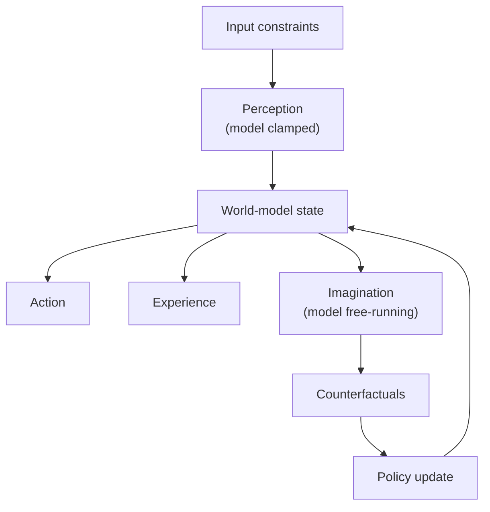
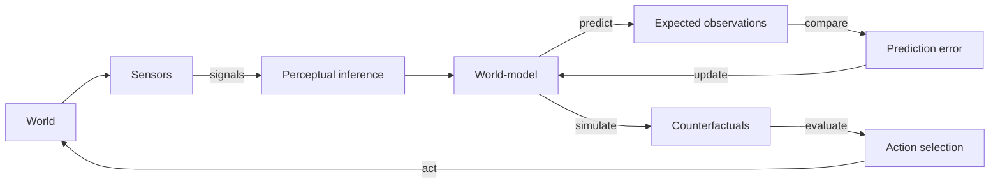
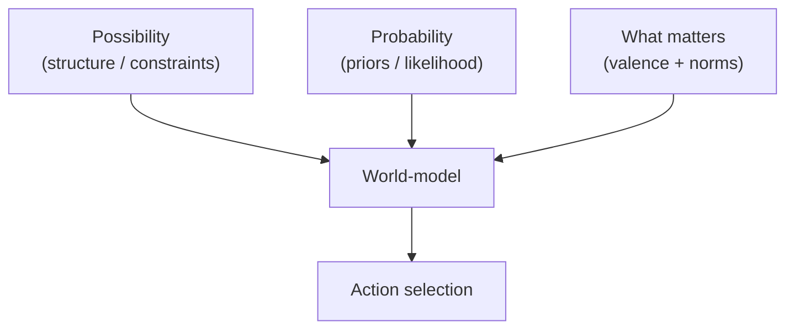

# Chapter 2: Models and Representation

## Motivation / puzzle
[BACH] A mind does not have direct access to reality. It has signals. If it acted on signals alone, it would behave like a reactive device. The distinctive feature of mind is that it controls the future, and future control requires a model: a way to represent what is not currently observed, what might happen next, and what would happen under counterfactual actions. <!-- src: yt_UkAOHrbcnAs @ 00:24:59 -->

[BACH] The puzzle is not whether minds use representations, but what "representation" really means. If representation is treated as a picture inside the head, it becomes mysterious. If representation is treated as a functional role inside a control architecture, it becomes a design constraint: without representation, there is no stable prediction; without prediction, there is no robust agency. <!-- src: yt_DYm7VBaEmHU @ 00:08:24 -->

[BACH] We will use "knowledge" in a control-first sense: we do not begin with privileged access to the essences of things. We begin with observations and constraints, and we construct objects as stable roles inside models that let us predict and control. <!-- src: yt_UkAOHrbcnAs @ 00:24:59 -->

## Definitions introduced or refined
[BACH] <!-- src: yt_UkAOHrbcnAs @ 00:24:59 -->
- Representation: an internal structure that stands in for something else in a way that supports inference for control.
- Model: a representation with dynamics; it can be advanced, updated, and queried.
- World-model: the integrated model of the environment and its causal regularities, at the resolution required for the agent's control.
- Object (in a model): a constructed stable role that captures an invariant in how the world changes when the object is present.
- Abstraction: a compressed representation that discards detail while preserving control-relevant invariances.
- Simulation: running the model forward to generate counterfactual trajectories (including imagined perceptions and imagined actions).
- Prediction: generating expectations for upcoming observations or state transitions; the prediction can be implicit (as in perception) or explicit (as in planning).
- Invariance: a stable pattern at some level of description that remains useful for prediction/control even as lower-level details change.

[SYNTH] A model is not defined by truth alone. It is defined by usability: what it allows the system to predict, compress, and control. Even a physically "wrong" model can be functionally adequate if it preserves the right invariances at the system's scale.

## Model (function + mechanism + phenomenology)
[BACH] Function: the world-model is the internal object the agent uses to regulate the future. The agent is not only asked "what is the world like now?" but also "what will the world be like if I do X?" Those are model queries. <!-- src: yt_UkAOHrbcnAs @ 00:24:59 -->

[BACH] Mechanism: a model can be implemented in many ways. In nervous systems, it can be distributed across circuits whose state evolves by learned dynamics. In machines, it can be implemented by explicit simulators, learned networks, or hybrids. The mechanism matters for efficiency and limitations, but the function is the same: convert past interaction into structured expectations. <!-- src: yt_UkAOHrbcnAs @ 00:24:59 -->

[BACH] Phenomenology: perception is not raw input. It is the model settling into an interpretation of input. The "realness" of the world in experience is the stability of the interpretation: when the model is coherent enough to support action, the world is present. <!-- src: yt_UkAOHrbcnAs @ 00:24:59 -->

[BACH] This also clarifies the sense in which mental objects are "virtual": they exist as causal patterns at a particular level of abstraction. A person is not visible in a microscope image of neurons, just as Minecraft is not visible in a microscope image of transistors. Yet both are real insofar as they are implemented as stable causal structure at an appropriate level of description. <!-- src: yt_DYm7VBaEmHU @ 00:08:24 -->

[BACH] Model constraints come in multiple kinds. At minimum, a usable world-model distinguishes: <!-- src: yt_UkAOHrbcnAs @ 00:24:59 -->
- what is possible (structural constraints),
- what is likely (probabilities / priors),
- and what matters (valence and norms as control constraints).

[SYNTH] This separation matters because many confusions about mind come from collapsing these axes: treating "likely" as "true", treating "matters" as "is", or treating "possible" as if it were unconstrained fantasy.

### A model is an instrument of control
[BACH] A world-model is not an ornament that sits next to behavior. It is part of behavior: it is the internal causal structure that allows behavior to be selected by anticipated consequences rather than by immediate stimulus. In this sense, "to model" is to act in an internal medium. <!-- src: yt_UkAOHrbcnAs @ 00:24:59 -->

[BACH] This provides an operational handle on otherwise slippery words like "meaning". A representation means something to the agent when it plays a role in control: when treating this internal state as standing for some external condition makes prediction and policy selection better. Meaning is not injected by physics; it is constructed by the agent's use of internal states. <!-- src: yt_UkAOHrbcnAs @ 00:24:59 -->

[SYNTH] This also motivates why realism about models should be pragmatic rather than mystical. A model can be useful while being ontologically wrong in detail, because what matters for the agent is preserving invariances at the scale of control. Conversely, a model can be ontologically "correct" in a physics sense yet useless for the agent, because it is too fine-grained to guide action.

### Objects are constructed as stable roles
[BACH] In computationalist functionalism, the move "objects are functions" does not mean that objects are mere words or mere conventions. It means that an object, as represented, is defined by the functional differences its presence makes in the modeled world: what it enables, blocks, or changes in the evolution of states. <!-- src: yt_UkAOHrbcnAs @ 00:24:59 -->

[BACH] This is why objecthood is tied to invariance. A cup remains a cup across lighting changes, viewpoints, and textures because the invariance is not in the pixels; it is in the causal structure relevant to control: containment, graspability, fragility, and a family of expected interactions. <!-- src: yt_DYm7VBaEmHU @ 00:08:24 -->

[SYNTH] A practical disambiguation: "object" here is not "thing-in-itself". It is "handle in a model that captures a control-relevant invariant." The handle can correspond to something real in the world, but its boundaries and identity conditions are determined by what the agent must predict and control.

### Symbol grounding as a modeling constraint
[BACH] If one tries to build models purely in language-like symbols without grounding them in predictive control, one runs into the symbol grounding problem: the symbols fail to acquire stable operational meaning for the system. They can be manipulated, but the manipulation does not connect to control of the world. <!-- src: yt_UkAOHrbcnAs @ 00:24:59 -->

[BACH] This is one reason why perception and imagination can be treated as the same kind of process under different constraints. A grounded model is one where internal symbols are continuously disciplined by prediction error and by the consequences of action. When that discipline is absent, symbols can drift into self-referential games that look fluent but do not steer the future. <!-- src: yt_34VOI_oo-qM @ 00:12:50 -->

### Models require a representational language (computationalism as construction)
[BACH] A model is not only a set of stored facts. It is a representational language plus a way to interpret and update that language under constraint. If the mind is to build models "from the ground up", it must have a constructive basis: smaller parts that can be composed into larger representational structures. <!-- src: yt_UkAOHrbcnAs @ 00:24:59 -->

[BACH] This is one way computationalism connects to epistemics. Computationalism, in this usage, is not the claim that everything is digital. It is the claim that for a system to represent anything, it must build a language of representation and realize it constructively. Representation cannot be magic; it must be implemented. <!-- src: yt_DYm7VBaEmHU @ 00:08:24 -->

[NOTE] This also explains why the gap between mathematics and natural language is invoked here. Mathematics is precise but narrow; natural language is rich but ambiguous. The mind sits in the gap: it must build representational languages that are precise enough for reliable inference and rich enough to model lived reality. In modern engineering terms, this is the motivation for treating models as program-like structures rather than as static pictures.

### Models at multiple scales (why there isn't one world-model)
[BACH] A mature mind contains many models at many levels of abstraction. Some are fast and local (perceptual priors), some are slow and global (social expectations, identity), some are explicit (a story you can tell), and many are implicit (policies you can only demonstrate). <!-- src: yt_UkAOHrbcnAs @ 00:24:59 -->

[SYNTH] This matters because it prevents a false dichotomy between "the model" and "the world". What exists is a stack: multiple partial models with different costs, latencies, and error signals. Coherence is the property that lets these partial models act as one agent.

### Objects as roles (functional objects)
[BACH] An object, in this framing, is not a tiny picture in the head. It is an invented handle for an invariant: a stable way the world changes when the object is present. "Cup" is a role that predicts what will happen if you apply force, how liquids behave relative to it, and which actions are available. This is why objects can survive enormous changes in sensory data: the invariance is at the level of control. <!-- src: yt_UkAOHrbcnAs @ 00:24:59 -->

[SYNTH] This makes many philosophical disputes easier to locate. If you insist that an object is "whatever the world is in itself", you are asking for a metaphysical primitive. If you treat objects as model roles built for control, you get an engineering criterion: does this representation support stable prediction and action?
### Perception and imagination as model modes
[BACH] Perception and imagination differ mainly by constraint. In perception, the model is clamped by incoming signals: prediction errors are forced to be resolved by updating the interpretation. In imagination, the model can run counterfactual trajectories with fewer constraints from current input. <!-- src: yt_UkAOHrbcnAs @ 00:24:59 -->

[SYNTH] This is why hallucination is not an alien phenomenon: it is what happens when "imagination mode" leaks into perception, or when sensory constraints are insufficient to stabilize the intended interpretation.

### Counterfactuals: why a model must be runnable
[BACH] A representation becomes a model when it has dynamics: it can be advanced, perturbed, and queried. This matters because agency is counterfactual by nature. The agent is constantly asking some version of: "if I do this, what will happen?" If the internal structure cannot answer that question, it cannot support robust control. <!-- src: yt_UkAOHrbcnAs @ 00:24:59 -->

[BACH] This is also why simulation is not an optional cognitive luxury. For a planning system, simulation is the mechanism by which the agent can evaluate futures without paying the cost of acting them out. In humans, this appears as imagination and deliberation. In machines, it can be explicit search, learned world-model rollout, or hybrid systems. <!-- src: yt_UkAOHrbcnAs @ 00:24:59 -->

[SYNTH] The phrase "the brain is a prediction machine" is too vague unless it is grounded in this counterfactual role. Prediction is not merely forecasting the next sensory input; prediction is the substrate for intervention: the ability to predict what would happen under different actions.

## Worked example
[NOTE] A person walks through a dark room.

They do not need to represent every photon. The world-model contains invariances: the geometry of the room, the likely location of furniture, the body's own reach. With sparse cues, the model stabilizes an interpretation ("there is a doorway there") that is good enough for control. This is why the room can feel present even when it is not fully observed.

[NOTE] An illusion is a case where the model stabilizes the wrong interpretation because the input is ambiguous or because the priors are miscalibrated. A hallucination is a case where the model generates content with insufficient constraint from input. Both are failures of inference, not anomalies outside of modeling.

[NOTE] A second example: driving.

A driver does not compute physics from scratch. The model contains abstractions like lane boundaries, affordances ("this gap is passable"), and other agents ("that car is about to merge"). Most of what the driver experiences as "seeing" is the model locking onto an interpretation that supports safe action. When the model is wrong (black ice, an unseen cyclist), the failure is revealed as prediction error, surprise, and an urgent shift of attention.

[NOTE] A third example: conversation as model coordination.

In a conversation, the agent is not only predicting the physical world; it is predicting another agent's model. The listener infers the speaker's intent, beliefs, and social stance, and updates their own expectations about what will happen next. Much of what feels like "understanding language" is the world-model and social-model coordinating: a compressed signal (words) is used to update a rich model of an agent in a context.

This matters because it shows that models are not only about external objects. They are also about other models. In social worlds, the reality you must control includes the beliefs and commitments of other agents.

## Predictions / implications
[SYNTH]
- Models are lossy by design: they keep what matters for control and discard what does not. Lossiness is a feature, not a bug.
- "Understanding" is not a separate magic faculty; it is the ability to maintain models that are compressive and useful for prediction and control.
- The boundary between perception and imagination is a boundary of constraint, not of kind. Both are model states; perception is model state constrained by current sensory evidence.

## Where people get confused
[NOTE]
- Model vs territory: treating a model as a mirror of the world rather than as a control-oriented abstraction.
- Data vs model: treating a pile of observations as if it were already a model.
- Collapsing constraints: treating probability as truth, or treating valence/norms (what matters) as if they were properties of the territory rather than properties of the model/controller.
- Simulation vs simulacrum: a simulation has internal causal structure that can be interacted with; a mere sequence of images (a movie) does not.
- "Virtual" vs "not real": virtual objects can be real as implemented causal patterns, even if they are not fundamental in physics.
- Object vs label: confusing the word used to coordinate (language) with the invariant the model is tracking (control-relevant role).

## Anchors (sources + timecodes)
- yt_UkAOHrbcnAs @ 00:24:59 (keywords: model, world model)
- yt_UkAOHrbcnAs @ 00:26:20 (keywords: model, world model)
- ccc_38c3_self_models_of_loving_grace @ 00:18:49 (keywords: model, world model)
- ccc_38c3_self_models_of_loving_grace @ 00:24:14 (keywords: consciousness, model, simulate)
- ccc_35c3_10030_the_ghost_in_the_machine @ 00:27:50 (keywords: model, possibility, probability, valence, norms)
- yt_DYm7VBaEmHU @ 00:08:24 (keywords: computationalism, object, function)
- yt_DYm7VBaEmHU @ 00:05:37 (keywords: Wittgenstein, programming language, symbol grounding)
- yt_dW5uZLCm0Tg @ 02:45:53 (keywords: model, world model)
- yt_34VOI_oo-qM @ 00:12:50 (keywords: model, self model, simulation)
- yt_34VOI_oo-qM @ 00:25:22 (keywords: consciousness, simulate, simulation)
- ccc_37c3_12167_synthetic_sentience @ 00:18:19 (keywords: model, world model)

## Open questions / tensions
[OPEN]
- What is the minimal structure that deserves the name "world-model": a predictive state, a simulator, a generative model, or an explicit causal graph?
- How much of everyday perception is top-down completion versus bottom-up correction?
- Which forms of modeling are prerequisite for self-modeling (and which are merely helpful)?

## Takeaways
- Representation is the prerequisite for prediction; prediction is the prerequisite for control.
- World-models are built for agency, not for mirror-accuracy.
- Perception and imagination are both model states; they differ by constraint.

## Bridge
We now have models and representations, but we still cannot call the system an agent until prediction is used for goal-directed control. Next chapter: Agents and Control, where goals, policies, commitments, and layered feedback loops turn modeling into agency.
