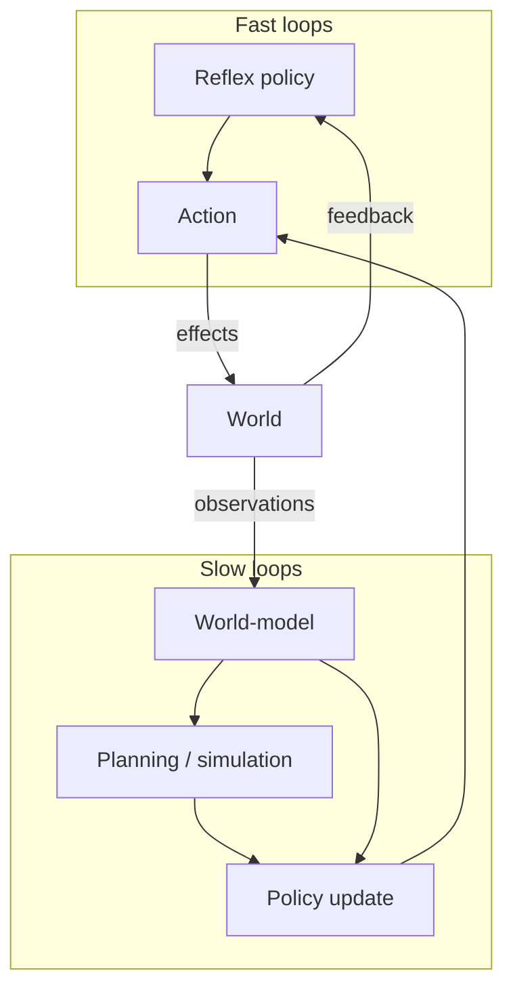
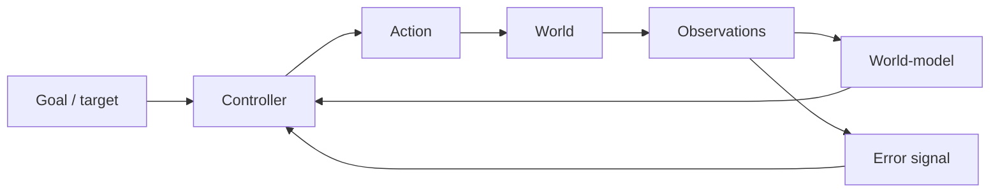

# Chapter 3: Agents and Control

## Motivation / puzzle
[BACH] A system that merely predicts is not yet an agent. Agency begins when prediction is used for control: selecting actions so that the future becomes more like the system prefers. <!-- src: ccc_38c3_self_models_of_loving_grace @ 00:32:16 -->

[BACH] The puzzle is that agency often sounds metaphysical ("free will", "self", "choice"), but it can be framed as an engineering property: a control architecture that uses internal models to regulate the future. Once this is understood, agency becomes something that comes in degrees, exists at multiple scales, and admits failure modes. <!-- src: ccc_38c3_self_models_of_loving_grace @ 00:32:16 -->

[BACH] This also provides a non-mystical home for many everyday notions: responsibility (which policies did the system implement), competence (how good were its models), and autonomy (how much of its own goal structure and policy selection is internal rather than externally imposed). <!-- src: ccc_38c3_self_models_of_loving_grace @ 00:32:16 -->

## Definitions introduced or refined
[BACH] <!-- src: ccc_38c3_self_models_of_loving_grace @ 00:32:16 -->
- Control system: a closed-loop regulator that compares actual state to desired state and acts to reduce error.
- Goal: a represented constraint that defines a target region in state space.
- Preference: the ordering the system imposes on futures; a way of saying which errors matter.
- Policy: a mapping from modeled state to action, potentially learned.
- Error signal: information about deviation from a target (or from predicted state) used to adjust action and learning.
- Viability constraints: a set of states the system must remain within to continue existing as the kind of system it is.
- Commitment: a constraint that the agent treats as binding over time (often required for long-horizon coordination).
- Agency: the system-level property of regulating the future via model-based control rather than only regulating the present.

## Model (function + mechanism + phenomenology)
[BACH] Function: an agent is a control system with a world-model. If the system can anticipate the consequences of its actions, it can regulate not only the present but also the future. This is where goal-directedness, apparent knowledge, and apparent preference become visible as stable causal patterns. <!-- src: ccc_38c3_self_models_of_loving_grace @ 00:32:16 -->

[BACH] Mechanism: control can be implemented as nested loops. Some loops are fast (reflex-like), some are slow (deliberative). The mind is not one loop; it is a stack of loops that coordinate through shared representations. <!-- src: ccc_38c3_self_models_of_loving_grace @ 00:32:16 -->

[BACH] Phenomenology: the feeling of agency is the subjective aspect of control. When the system predicts that an action will follow from its internal deliberation and then sees the action occur, it experiences authorship. When internal policies conflict, it experiences divided will. <!-- src: ccc_38c3_self_models_of_loving_grace @ 00:32:16 -->

### Control, not magic (and not "maximize a number")
[BACH] In this framing, control is the primitive, not optimization. Many discussions of agency in AI drift toward a single-number picture: the agent has a utility function, it maximizes expected utility, therefore it "chooses". This control framing is more structural and more realistic. A system is an agent to the extent that it maintains feedback loops that keep it inside viability constraints while pursuing preferred states. <!-- src: ccc_38c3_self_models_of_loving_grace @ 00:32:16 -->

[BACH] This matters because real agents are bandwidth-limited, compute-limited, and time-limited. They do not have access to the whole state space, do not search globally, and do not perfectly optimize. Instead, they implement layered regulators that trade off error signals at different time scales. <!-- src: ccc_38c3_self_models_of_loving_grace @ 00:32:16 -->

[SYNTH] A useful disambiguation:
- Optimization is a mathematical idealization (useful for analysis).
- Control is an engineering reality (implemented by feedback, heuristics, and learned policies).
When people argue about "rationality" or "free will" as if it required global optimization, they silently replace control with an ideal that no biological organism implements.

### Viability constraints and the long shadow of homeostasis
[BACH] Every agent sits inside constraints: some constraints are hard (physics, mortality), some are soft (social roles, habits), some are internal (drives, identity). Viability constraints are the conditions that keep the agent from falling apart as an agent: energy, integrity, and the maintenance of the learning machinery itself. <!-- src: ccc_38c3_self_models_of_loving_grace @ 00:32:16 -->

[BACH] This is where homeostasis enters as the simplest control archetype. A homeostatic variable defines an error signal ("too hot", "too hungry"). But in an advanced mind, homeostasis expands into a hierarchy: the system can keep itself viable not only by reflex but by planning, social coordination, and self-modification. <!-- src: ccc_38c3_self_models_of_loving_grace @ 00:32:16 -->

### Commitments as control objects
[BACH] Commitments are control constraints that are treated as binding over time. They allow the agent to behave as if it had a stable policy across changing local temptations. Without commitments, long-horizon control collapses: the agent becomes a sequence of local optimizations, incoherent across time. <!-- src: ccc_38c3_self_models_of_loving_grace @ 00:32:16 -->

[BACH] Commitments exist at multiple scales. A motor skill commitment is "practice the same movement again." A social commitment is "keep your promise." An identity commitment is "be the kind of person who does X." In each case, the functional role is the same: constrain policy selection so that the future self can be predicted (by the agent itself and by others). <!-- src: ccc_38c3_self_models_of_loving_grace @ 00:32:16 -->

[SYNTH] This is one point where agency becomes inseparable from social reality. If other agents can model your commitments, they can coordinate with you. If they cannot, you are an unreliable controller from their perspective, which reduces everyone's agency.

### Meta-control: control of control
[BACH] Once an agent has multiple loops, it needs policies about policies. The system must decide which loop gets authority now, which error signals dominate, and what counts as a "good" update. This is one core sense in which minds are different from simple controllers: they regulate not only the world, but also their own control architecture. <!-- src: ccc_38c3_self_models_of_loving_grace @ 00:32:16 -->

[BACH] In practice, this meta-control is implemented through attention, working memory, and self-modeling. The agent represents itself as a controller, and this representation becomes part of the input to control. Agency and self-modeling interlock: to regulate the future, the agent must regulate itself. <!-- src: ccc_38c3_self_models_of_loving_grace @ 00:32:16 -->

[SYNTH] This also makes "agent boundaries" fuzzy. A person can contain semi-autonomous sub-agents (habits, roles), and a society can behave like an agent when institutions stabilize enough shared commitments. Agency is an abstraction over control structure, not a binary property of organisms.

### Goals as represented constraints
[BACH] In this framing, a goal is not a magical attractor that pulls on the universe. A goal is a represented constraint inside the controller: a condition under which error is reduced and behavior becomes stable. Goals can be explicit ("write a chapter") or implicit (maintain posture), but in both cases they are implemented as comparators and biases inside the control stack. <!-- src: ccc_38c3_self_models_of_loving_grace @ 00:32:16 -->

[SYNTH] This also clarifies why goals can conflict. There is no single objective function in a complex agent. There are many constraints, many error signals, and a governance process that arbitrates among them. "Having a goal" is shorthand for "some constraints currently dominate policy selection."

### Agency is an interpretation of control structure
[BACH] Agency is not only something a system has; it is also something observers attribute when the system's behavior is best explained by model-based control. When a system reliably maintains a goal state across perturbations, observers infer a controller. When it adapts and learns, observers infer a more complex agent. <!-- src: ccc_38c3_self_models_of_loving_grace @ 00:32:16 -->

[SYNTH] This is why agency comes in degrees and scales. The same physical substrate can be described as many agents (subsystems) or as one agent (integrated controller), depending on the level at which coherent control is implemented.

### Responsibility and autonomy (framed as control properties)
[SYNTH] Words like responsibility and autonomy are often treated as moral primitives. In a control framing they become descriptive. A system is responsible, in the minimal sense, when it is the locus of a policy that causes outcomes and can update that policy in response to feedback. A system is autonomous to the extent that its goals and governance are internal rather than imposed moment-to-moment by an external controller.

[SYNTH] This does not settle ethics, but it makes ethical questions more precise. Instead of asking "does this system have free will?", one asks: what control capacities does it have; what commitments can it maintain; what incentives train it; and what governance loops constrain it?

## Worked example
[NOTE] A person is driving to a time-sensitive meeting in city traffic.

- Agent: the integrated control stack selects actions to keep the car within viability bounds (lane, speed, collision margins).
- Control: steering and braking close fast feedback loops (error = deviation from lane/spacing targets), while a slower loop maintains commitments ("take this exit").
- Degrees of agency show up when tradeoffs appear (comfort vs speed vs safety) and the system must arbitrate under uncertainty.

## Predictions / implications
[SYNTH]
- Agency is not binary. It increases with the depth and accuracy of the world-model and with the time horizon of control.
- "Choice" is not a metaphysical gap in causality; it is a property of architectures that select among counterfactual futures.
- Commitments are not optional for advanced agents: without them, long-horizon coordination collapses into short-term opportunism.

## Where people get confused
[NOTE]
- Equating agents with organisms. Organisms implement agents; agents are abstractions over control structure.
- Equating control with domination. Control is regulation under feedback, often gentle and distributed.
- Assuming a central homunculus. In a layered control stack, "the agent" is an emergent integration, not a single executive component.
- Confusing "goal-directed" with "conscious". Goal-directed control can be implemented without reportable awareness; consciousness is a different organizational hypothesis.

## Anchors (sources + timecodes)
- ccc_38c3_self_models_of_loving_grace @ 00:32:16 (keywords: agent, control, control system)
- ccc_37c3_12167_synthetic_sentience @ 00:32:49 (keywords: agent, control, control system)
- yt_skXe_cUucO8 @ 00:02:08 (keywords: agent, control, control system)
- yt_uc112kET-i0 @ 00:02:07 (keywords: agent, control, control system)
- yt_DYm7VBaEmHU @ 00:06:57 (keywords: homeostasis, feedback, control)
- ccc_35c3_10030_the_ghost_in_the_machine @ 00:30:38 (keywords: commitment, training, control)
- yt_DYm7VBaEmHU @ 00:44:14 (keywords: agent, control, controller)
- yt_3MkJEGE9GRY @ 00:10:29 (keywords: agent, control)
- yt_3MkJEGE9GRY @ 01:06:10 (keywords: agency, control, simulation)
- yt_TbpK2daY5_Y @ 00:02:11 (keywords: agent, control, model)

## Open questions / tensions
[OPEN]
- What minimal set of mechanisms is required for model-based control (beyond reactive control)?
- How does an agent represent commitments so they remain binding under emotional modulation and shifting context?
- Which aspects of agency require explicit self-modeling (as opposed to implicit control)?

## Takeaways
- Agency is model-based control of the future, not a metaphysical add-on.
- Agents exist as layered control loops coordinated through shared models.
- Goal-directedness, knowledge, and preference can be understood as projections of control architectures.

## Bridge
We can now describe agency as layered control under constraints, but we still cannot explain how the architecture improves itself and generalizes beyond its initial competence. Next chapter: Learning and Understanding, where learning updates model and policy and yields usable compression.
