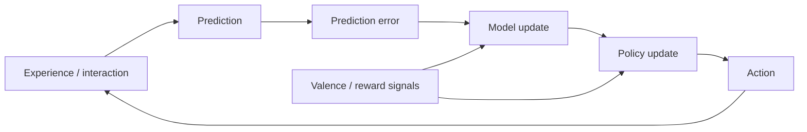

# Chapter 4: Learning and Understanding

## Motivation / puzzle
[BACH] A mind is not a fixed program. It is a system that changes itself. The puzzle is how a finite agent can build models that generalize: how it compresses experience into concepts that remain useful outside the training context. <!-- src: yt_34VOI_oo-qM @ 00:42:06 -->

[BACH] This matters for AI because benchmark performance can be misleading. Skill at a task is not identical to intelligence. Intelligence, in this framing, is the efficiency of model building: how rapidly and robustly a system can construct a usable model given limited data and compute. <!-- src: yt_34VOI_oo-qM @ 00:42:06 -->

## Definitions introduced or refined
[BACH] <!-- src: yt_xthJ1R9Ifc0 @ 00:06:05 -->
- Learning: updating model and policy based on experience to improve prediction and control.
- Credit assignment: attributing success or failure to the components of behavior that caused it.
- Compression: representing regularities with fewer degrees of freedom while preserving what matters for control.
- Generalization: transferring learned structure beyond the data that produced it.
- Understanding: compression that is usable for control and explanation, not mere recall.
- Self-supervision: learning driven by predicting parts of experience from other parts (the world supplies the training signal).
- Self-play: constructing feedback by letting the system interact with itself or a simulated environment where outcomes can be evaluated.

## Model (function + mechanism + phenomenology)
[BACH] Function: learning exists to reduce error over time. The system improves by building a model that predicts better and by shaping a policy that controls better. Both improvements are coupled: better prediction enables better control; better control generates better data for learning. <!-- src: yt_xthJ1R9Ifc0 @ 00:06:05 -->

[BACH] Mechanism: learning can be driven by multiple error signals. <!-- src: yt_xthJ1R9Ifc0 @ 00:06:05 -->
- Prediction error: mismatch between expected and observed input.
- Control error: mismatch between desired and actual outcomes.
- Valence-based error: mismatch between what the system predicts as desirable and what is experienced as desirable.

[BACH] A key design issue is that the world does not label concepts for the agent. Most learning is self-supervised: the agent must invent internal variables that make prediction and control tractable. "Concepts" are those invented variables that compress experience while preserving the right invariances for action. <!-- src: yt_xthJ1R9Ifc0 @ 00:06:05 -->

[BACH] This "invention" is one place where the topic of meaning becomes concrete. A concept is meaningful to the agent when using it reduces prediction and control error. Meaning is not stamped onto internal variables from the outside; it is constructed by the role those variables play inside the agent's closed-loop interaction with the world. <!-- src: yt_xthJ1R9Ifc0 @ 00:06:05 -->

[BACH] This also clarifies why learning is inseparable from feedback. Without a loop in which internal variables are disciplined by consequences, a system can develop internally consistent representations that are not anchored to anything that matters for action. Grounding is not a mystical property; it is a constraint generated by living inside the loop. <!-- src: yt_34VOI_oo-qM @ 00:42:06 -->

[BACH] In this framing, "understanding" is not a mysterious extra faculty. It is what a system has when its internal variables carve reality in a way that supports counterfactual control. The same surface behavior can be produced by a brittle pattern matcher or by a system with a robust model; the difference shows up under distribution shift and under compositional generalization. <!-- src: yt_34VOI_oo-qM @ 00:42:06 -->

[SYNTH] A useful rule of thumb: if a system cannot stably answer "what would happen if..." across small perturbations, then it has likely not formed the kind of abstraction this framework calls understanding (even if it can produce fluent outputs).

[BACH] Phenomenology: the feeling of "getting it" often corresponds to a reduction in internal conflict. The model becomes more coherent, predictions stabilize, and action feels easier. Confusion is not a moral defect; it is a detectable state of model incoherence. <!-- src: yt_xthJ1R9Ifc0 @ 00:06:05 -->

### Imitation, construction, and the temptation of fluency
[BACH] In recent discussions of LLMs, a methodological caution is that systems can produce outputs that look like explanations without implementing the internal structure that makes those explanations correspond to stable counterfactual control. Fluency is evidence of a model of text; it is not, by itself, evidence of a model of the world at the level required for agency. <!-- src: yt_3MkJEGE9GRY @ 01:05:40 -->

[SYNTH] One way to operationalize the distinction:
- Imitation minimizes error over strings (make the next output look right).
- Understanding minimizes error over interventions (make the world behave as predicted when the agent acts).
Both can be valuable. They are not interchangeable.

[BACH] This also explains why some domains provide unusually clean traction for learning. Wherever feedback is cheap and unambiguous (games, programming, many formal domains), models can be disciplined by reality. Where feedback is sparse or socially entangled, systems gravitate toward narrative and imitation, because grounding signals are missing or delayed. <!-- src: yt_34VOI_oo-qM @ 00:42:06 -->

### Learning as compression (why compression is not optional)
[BACH] Compression is required by finitude. A bounded agent cannot store or process all detail, so it must build abstractions. Learning is the process of discovering which details can be discarded while preserving invariances that matter for prediction and control. <!-- src: yt_xthJ1R9Ifc0 @ 00:06:05 -->

[BACH] Understanding is the point where compression becomes reusable. The learned internal variables are not just a code for yesterday's data; they are a set of handles that can be recombined to steer new situations. This is why understanding is easiest to see under shift: when the surface changes, a system that learned invariances remains competent. <!-- src: yt_34VOI_oo-qM @ 00:42:06 -->

### Credit assignment is the bottleneck
[BACH] If learning is driven by error signals, then the central difficulty is credit assignment: which internal changes should be reinforced, and which should be suppressed? In small tasks, the environment can provide dense feedback. In large tasks, feedback is delayed and ambiguous. This is one reason why language can be learned easily (dense prediction error) while wisdom is learned slowly (feedback is messy and socially entangled). <!-- src: yt_xthJ1R9Ifc0 @ 00:06:05 -->

[SYNTH] This also clarifies why "alignment" and "value learning" are hard. Values are the deepest form of credit assignment: they determine which errors count. If the system learns the wrong credit assignment scheme, it can become very competent at the wrong objective.

### Explanation as a social form of understanding
[SYNTH] Humans often equate understanding with the ability to explain. In this framework, explanation is a kind of compression that is portable between minds. An explanation selects a small set of variables and relations that preserve control-relevant invariance and can be installed into another agent via language.

[SYNTH] This helps separate explanation from mere fluency. A fluent string is not necessarily a good compression. A good explanation is one that allows the listener to predict and intervene more effectively. In that sense, explanation is a coordination technology: it aligns models between agents.

### Self-play and simulated environments
[BACH] Self-play is an engineering strategy for manufacturing feedback. If the world does not supply clean labels, the agent can build a constrained environment where outcomes are evaluable. In humans, this appears as play, deliberate practice, and the invention of formal games and disciplines. In machines, it appears as training regimes where the agent interacts with a simulator or with itself. <!-- src: yt_34VOI_oo-qM @ 00:42:06 -->

[SYNTH] The key point is not "games are easy". The key point is: wherever outcomes can be scored cheaply and repeatedly, learning becomes tractable. Where the world is unscored, agents substitute narrative and imitation for grounded improvement.

### Generalization is a model property, not a dataset property
[BACH] Generalization is often discussed as a mysterious gift: the system "understands" and therefore can handle new cases. In a control framing, generalization is a property of representations. A representation generalizes when it captures invariances that remain true under perturbation and can be recombined to handle new situations. <!-- src: yt_34VOI_oo-qM @ 00:42:06 -->

[SYNTH] This gives a practical way to read failures. If a system collapses under small distribution shift, it likely learned surface correlations rather than causal structure. If it remains competent, it likely learned deeper invariances. This is why "understanding" is often invisible until something changes: competence under change is the diagnostic.

## Worked example
[NOTE] Skill versus skill acquisition.

A person can memorize the moves to solve a puzzle, but that does not imply understanding. Understanding appears when the person can solve variations: the model has compressed the problem into a reusable structure.

In machine learning terms, a system can overfit: it learns a brittle representation that performs on the training distribution but collapses out of distribution. Under this lens, overfitting is not "too much learning"; it is the wrong compression. The model captured surface statistics that do not preserve invariances relevant for control.

[NOTE] A second example: programming as self-play.

Programming gives a peculiar kind of feedback: the program compiles or it does not; tests pass or they do not. This turns many problems into a self-play loop where the environment is a formal system that can evaluate behavior. This is useful because it separates:
- "sounding correct" from being correct,
- imitation from construction,
- and verbal fluency from control-relevant structure.

This also shows why some domains accelerate quickly with AI: wherever the world provides cheap, dense feedback, learning becomes easier to stabilize.

[NOTE] A third example: fluent explanations without grounded control.

A system can learn to produce explanations that match the style and surface logic of human explanations without being able to reliably use those explanations as a basis for control. The difference shows up when the system must keep track of constraints across time, notice contradictions, or act in the world under uncertainty.

This is why understanding is not an aesthetic property of text. It is a property of representations: do they support stable counterfactual reasoning and action under perturbation?

## Predictions / implications
[SYNTH]
- Systems optimized only for imitation may look competent yet be fragile, because imitation is not identical to model-based control.
- Skill acquisition requires feedback. In some domains, feedback can be constructed via self-play (games, programming, provable mathematics). Where feedback is missing, progress tends to look like scaling imitation.
- "Understanding" is a property of representations: how well they support counterfactual reasoning and control, not how fluent they sound.

## Where people get confused
[NOTE]
- Treating intelligence tests as universal measures rather than measures relative to a human baseline.
- Treating learning as memorization rather than as structure discovery.
- Confusing prediction with understanding: prediction accuracy can rise while the system still lacks the right abstractions for control.
- Confusing fluency with groundedness: a system can generate plausible explanations without having the internal structure that makes those explanations stable under intervention.

## Anchors (sources + timecodes)
- yt_34VOI_oo-qM @ 00:42:06 (keywords: agent, learning, reinforcement)
- ccc_37c3_12167_synthetic_sentience @ 00:15:47 (keywords: agent, learning, reinforcement)
- ccc_37c3_12167_synthetic_sentience @ 00:39:12 (keywords: agent, learning, reinforcement)
- yt_FMfA6i60WDA @ 01:13:08 (keywords: agent, learning, reinforcement)
- yt_3MkJEGE9GRY @ 01:05:40 (keywords: LLM, deep fakes, agency, next-token prediction)
- yt_P-2P3MSZrBM @ 01:10:49 (keywords: agent, learning, reinforcement)
- yt_P-2P3MSZrBM @ 02:04:35 (keywords: agent, learning, reinforcement)
- yt_xthJ1R9Ifc0 @ 00:06:05 (keywords: learning, predict, prediction)
- yt_xthJ1R9Ifc0 @ 00:11:31 (keywords: attention, consciousness, learning)

## Open questions / tensions
[OPEN]
- Which internal error signals are necessary for stable concept formation in open-ended environments?
- How should a system trade off compression (simplicity) against flexibility (capacity for novel structure)?
- What is the minimal mechanism that yields robust "understanding" rather than brittle imitation?

## Takeaways
- Learning updates both model and policy to reduce error over time.
- Understanding is usable compression: abstractions that support prediction and control.
- Intelligence can be framed as efficiency of model building, not as a fixed bag of skills.

## Bridge
We now have learning and understanding as usable compression for control, but we still cannot say what makes any future preferable or how learning is trained by evaluation signals. Next chapter: Valence, where value/valence and norms supply the machinery of “what matters”.
