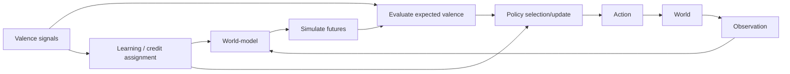

# Chapter 5: Valence (Why Anything Matters)

## Motivation / puzzle
[BACH] A world-model without preference is inert. It can predict, but it cannot choose. To become an agent, a system must have a way to mark futures as better or worse for itself. This marking is not an optional add-on; it is the control variable that turns prediction into motivation. <!-- src: yt_3MkJEGE9GRY @ 00:24:13 -->

[BACH] The puzzle is that "value" is often treated as either purely subjective ("just feelings") or purely formal ("a utility function"). In a control-theoretic framing, valence is a practical signal and a learned structure: it shapes what the system learns, what it attends to, and which policies it reinforces. <!-- src: ccc_35c3_10030_the_ghost_in_the_machine @ 00:27:50 -->

## Definitions introduced or refined
[BACH] <!-- src: ccc_35c3_10030_the_ghost_in_the_machine @ 00:27:50 -->
- Valence: a signal or structure that assigns positive or negative significance to states or outcomes for the system.
- Reward: a training signal used for credit assignment; not identical to value.
- Value: a learned predictive structure that estimates future valence under policies; a way of compressing what will matter later.
- Drive: a relatively persistent constraint shaping policy over time (e.g., homeostatic deficits, social needs).
- Norm: coordination-relevant constraint that shapes what "should" be the case beyond immediate pleasure/pain.
- Reward function (broad usage): the effective structure (valence + norms) that determines what gets reinforced and what the system treats as error.

[SYNTH] In this vocabulary, "valence" is the category; "pleasure" and "pain" are common phenomenological correlates, not definitions.

## Model (function + mechanism + phenomenology)
[BACH] Function: valence provides the objective function of the agent in the broadest sense: it defines which deviations count as error. Without valence, the system has no reason to prefer one future over another. With valence, the system can prioritize, allocate attention, and learn policy updates that increase expected viability and agency. <!-- src: ccc_35c3_10030_the_ghost_in_the_machine @ 00:27:50 -->

[BACH] Mechanism: in biological systems, credit assignment is mediated by neuromodulatory signals and their downstream effects on plasticity and network dynamics. In artificial systems, similar roles are played by reinforcement signals, intrinsic rewards, and learned value functions. The key point is not the exact biochemical implementation, but the architectural role: valence shapes learning and action selection. <!-- src: ccc_35c3_10030_the_ghost_in_the_machine @ 00:27:50 -->

[BACH] Phenomenology: valence is experienced as attraction and aversion, comfort and discomfort, relief and tension. But the experienced quality is not the whole story. The control variable can be present and shaping policy even when the system is not reflectively aware of it. <!-- src: ccc_35c3_10030_the_ghost_in_the_machine @ 00:27:50 -->

[BACH] A useful control-level intuition: pleasure and pain need not be treated as irreducible primitives. They can be understood as the inside of feedback loops. Pain corresponds to being off-target (and noticing the error); pleasure corresponds to error reduction as the loop approaches its target. <!-- src: ccc_35c3_10030_the_ghost_in_the_machine @ 00:59:20 -->

### Meaning is not injected by physics
[BACH] The physical world does not hand an agent "meaning" or "importance". The world delivers constraints and perturbations; the organism generates valuations. The same physical input can be experienced as catastrophic, trivial, or beautiful depending on the agent's learned value structure and current control state. <!-- src: ccc_35c3_10030_the_ghost_in_the_machine @ 00:37:19 -->

[SYNTH] This is the practical sense in which valence "colors" perception. It is not a story about mystical qualia; it is a statement about how evaluation is inseparable from interpretation in any system that must act.

### Norms: desired truths that constrain the agent
[BACH] Beyond immediate pleasure/pain, mature agents run on norms: constraints that are treated as binding even when they are locally costly. Norms are what make coordination possible across time and across agents. They allow an agent to act as if some propositions should become true ("I will keep my promise") even if short-term valence pulls elsewhere. <!-- src: ccc_35c3_10030_the_ghost_in_the_machine @ 00:56:55 -->

[BACH] One sharp way to characterize norms is as desired truths: beliefs that are held not because the agent has evidence (priors) but because the agent treats them as commitments that organize behavior. This framing is not meant to deny evidence; it is meant to explain the control role of "should". <!-- src: ccc_35c3_10030_the_ghost_in_the_machine @ 00:27:50 -->

[SYNTH] In a control vocabulary, norms are part of the reward function in the broad sense: they are the constraints that determine what gets reinforced and which futures are treated as admissible. This is why "alignment" cannot be reduced to hedonic signals: norms encode long-horizon coordination objectives.

### Value drift, stability, and internal negotiation
[BACH] Value is learned structure, and learned structure can drift. This is not a bug; it is part of what makes an agent adaptive. But it produces a stability problem: if values drift too quickly, commitments collapse; if values are frozen, the agent cannot grow and correct itself. <!-- src: ccc_35c3_10030_the_ghost_in_the_machine @ 00:37:19 -->

[SYNTH] In practical terms, complex agents solve this by layering. Some constraints are treated as more negotiable (tastes, local preferences). Some are treated as less negotiable (core identity commitments, social norms, survival constraints). The agent's lived experience of "inner conflict" often reflects this negotiation: competing value structures are simultaneously active and must be reconciled.

### Multiple valence channels (why a single reward is rarely enough)
[BACH] Even at the intuitive level, organisms do not have one monolithic reward. Hunger, pain, curiosity, belonging, and shame are different control variables. They can align or conflict. A stable agent needs mechanisms to arbitrate among them and to translate short-term signals into long-term value predictions. <!-- src: ccc_35c3_10030_the_ghost_in_the_machine @ 00:26:34 -->

[SYNTH] This reframes the folk question "what do you really want?" as an architectural question: which valence channels have authority in which contexts, and what does the agent treat as a binding commitment across contexts?

### Intrinsic motivation as value of learning
[BACH] Some motivations are not about consuming external rewards but about improving the model itself: reducing uncertainty, resolving prediction error, gaining competence. Curiosity can be treated as valence assigned to learning progress. This matters because it shows how an agent can be driven to explore even when immediate consumatory rewards are absent. <!-- src: yt_3MkJEGE9GRY @ 00:24:13 -->

[SYNTH] In artificial agents, this appears as intrinsic rewards for novelty or prediction improvement. In humans, it appears as play and intellectual exploration. In both cases, the functional role is to prevent the agent from getting stuck in locally comfortable but informationally poor regimes.

### Self-modification: access to the cookie factory
[BACH] The cookie metaphor can be sharpened into a warning. If an agent can access its own reward machinery, it can modify itself. This can be used for growth (changing habits, revising values) or for collapse (reward hacking). The danger is not that self-modification exists; it is that self-modification can be applied before the agent has a clear model of what it actually wants to become. <!-- src: ccc_35c3_10030_the_ghost_in_the_machine @ 00:38:16 -->

[SYNTH] This reframes a familiar life pattern. People often chase pleasure as if it were a scarce external resource. The cookie framing says: pleasure is a signal generated by your own control loops. The deeper question is which loops you want to train, which commitments you want to stabilize, and which values you want to become robust under stress.

## Worked example
[NOTE] A person is driving to a time-sensitive meeting in city traffic.

- Valence: being late tags some futures as urgent/aversive and reallocates attention toward time-saving options.
- Value vs reward: the "good" signal is not the honk or the thrill of speeding; it is learned value structure trading time, safety, and norms.
- Norms: even under pressure, constraints like "don't run red lights" keep coordination possible and bound the policy space.

## Predictions / implications
[SYNTH]
- Reward is not value. Reward is a local training signal; value is an internal predictive structure. Confusing them produces errors in both neuroscience talk and AI talk.
- Value is learned and therefore can drift. A stable agent needs mechanisms that prevent local reward capture from destroying global viability.
- If valence shapes attention, then what a system experiences as "salient" is partly a value-laden choice, not just a sensory fact.
- Reward hacking is a generic risk once an agent can model and modify its own learning signals. Any architecture that ties "good" to a manipulable internal signal will face this pressure.

## Where people get confused
[NOTE]
- Conflating valence with pleasure. Pleasure is a phenomenological correlate; valence is a control role.
- Treating value as an explicit utility function. Utility functions are formal abstractions; agents often implement values as distributed learned structures.
- Treating goals as static. In learning systems, goals and preferences can be updated by experience, development, and social context.
- Treating norms as mere opinions. In control terms, norms are constraints that change what futures are admissible and which policies get reinforced.
- Treating "meaning" as a property of physics rather than as a property of the agent's evaluative model.

## Anchors (sources + timecodes)
- ccc_35c3_10030_the_ghost_in_the_machine @ 00:27:50 (keywords: valence, norms, reward function)
- ccc_35c3_10030_the_ghost_in_the_machine @ 00:37:19 (keywords: function, reward, value)
- ccc_35c3_10030_the_ghost_in_the_machine @ 00:38:16 (keywords: reward function, reward hacking)
- ccc_35c3_10030_the_ghost_in_the_machine @ 00:56:27 (keywords: cookies, self-modification, reward hacking)
- ccc_35c3_10030_the_ghost_in_the_machine @ 00:56:55 (keywords: value, valence, pain, pleasure)
- ccc_35c3_10030_the_ghost_in_the_machine @ 00:59:20 (keywords: pain, pleasure, target value)
- yt_8mixT5_U0hk @ 00:00:26 (keywords: happiness, cookies, valence)
- yt_3MkJEGE9GRY @ 00:24:13 (keywords: alignment, model, motivation, self model)
- yt_skXe_cUucO8 @ 00:04:52 (keywords: value)
- yt_pB-pwXU0I4M @ 00:31:14 (keywords: agent, attention, motivation)
- yt_b6oekXIQ-LM @ 00:15:55 (keywords: agent, attention, motivation)
- yt_mofeg5Focxs @ 00:07:30 (keywords: attention, motivation)
- yt_FMfA6i60WDA @ 00:56:36 (keywords: agency, control, emotion, motivation)
- ccc_35c3_10030_the_ghost_in_the_machine @ 00:26:34 (keywords: predict, prediction, reward)
- yt_CcQMYNi9a2w @ 01:21:11 (keywords: curiosity, exploration, uncertainty)

## Open questions / tensions
[OPEN]
- How many distinct valence channels does a complex agent require (and what makes a channel distinct)?
- Which parts of value are biologically constrained versus culturally learned?
- What are the stable architectures for preventing reward hacking without freezing learning?

## Takeaways
- Valence is the control variable that makes prediction matter for an agent.
- Reward is a signal for learning; value is a learned predictive structure.
- Valence shapes both action selection and what becomes salient in experience.

## Bridge
We can now talk about valence/value as the machinery that makes futures matter, but we still cannot explain the rapid reconfiguration of priorities and policy under changing contexts. Next chapter: Emotion and Motivation, where emotions are treated as control modulators that shift attention, learning, and action readiness.
