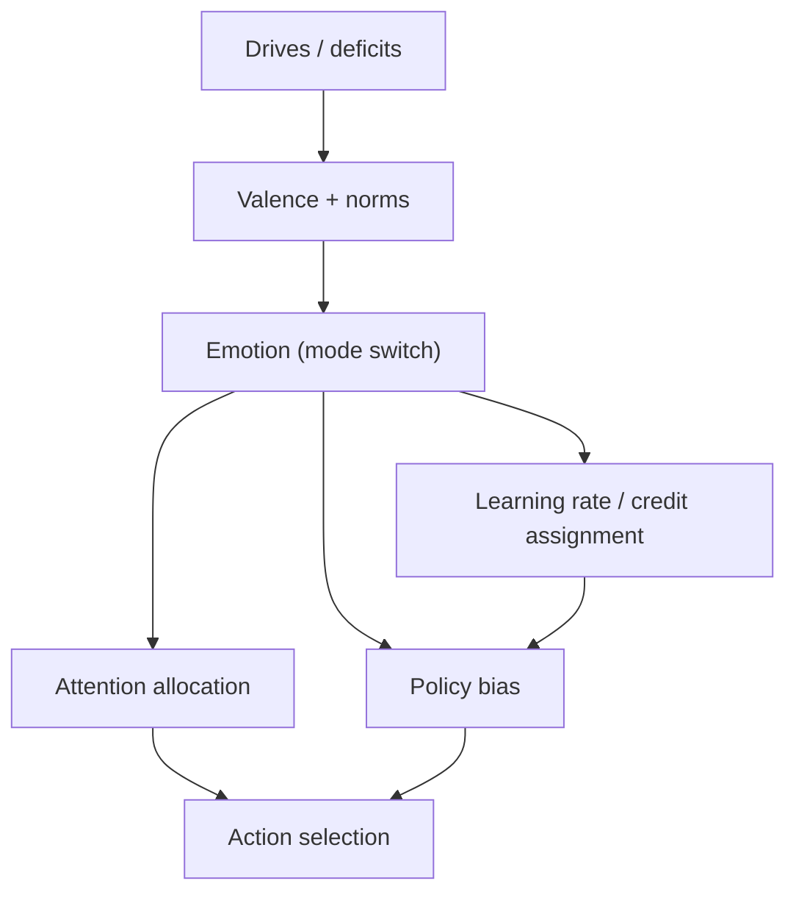

# Chapter 6: Emotion and Motivation

## Motivation / puzzle
[BACH] Emotions are often described as irrational noise that interferes with thinking. In a control framing, emotions are part of the control architecture: they are rapid global reconfigurations that help the system select actions and learn under uncertainty. <!-- src: yt_FMfA6i60WDA @ 00:56:36 -->

[BACH] The puzzle is to describe emotion precisely without either romanticizing it ("deep wisdom") or dismissing it ("animal residue"). What does emotion do, mechanistically and functionally, that a purely deliberative system would lack? <!-- src: yt_FMfA6i60WDA @ 00:56:36 -->

## Definitions introduced or refined
[BACH] <!-- src: yt_FMfA6i60WDA @ 00:56:36 -->
- Emotion: a pattern of control modulation that changes priorities, attention, and learning in response to context.
- Affect: the felt tone (valence and arousal) of the current control state.
- Motivation: the ongoing policy orientation produced by drives, values, and emotion-based modulation.
- Mood: a longer-lived bias in control parameters that shifts what the system treats as plausible and worth doing.

[SYNTH] "Affect" is useful as a low-dimensional summary of a much higher-dimensional control state. It is what the agent can often introspect directly: good/bad, energized/depleted, tense/relaxed. The rest of the control parameters are still there; they just are not always accessible to report.

## Model (function + mechanism + phenomenology)
[BACH] Function: emotion compresses a complex evaluation into a state change that makes action selection tractable. It is a coordination signal across subsystems: it changes what the system attends to, what it predicts, and which policies are reinforced. <!-- src: yt_FMfA6i60WDA @ 00:56:36 -->

[BACH] Mechanism: emotion can be implemented as changes in gain, thresholds, and neuromodulatory context that reweight competing policies and representations. It is not just a label on top of cognition; it is a change in the operating regime of the system. <!-- src: yt_FMfA6i60WDA @ 00:56:36 -->

[BACH] Phenomenology: emotions feel global because they are global. Fear narrows the field of action; grief collapses the expected value of futures; curiosity widens the search space. The feeling is the subjective aspect of the system being pushed into a particular control regime. <!-- src: yt_FMfA6i60WDA @ 00:56:36 -->

### Emotion as a mode switch (and why "irrational" is the wrong level)
[BACH] This framing makes a simple prediction: if emotions are modes of control, then calling them "irrational" is often a category error. What is rational depends on what the system is trying to control and under what constraints. A fear response can be locally suboptimal in some abstract utility sense while being globally rational for a bounded organism facing real-time risk. <!-- src: yt_FMfA6i60WDA @ 00:56:36 -->

[BACH] This also explains why emotions are entangled with learning. Affective states change the learning rate, the credit assignment landscape, and the salience of cues. In other words: emotion does not merely color experience after cognition; it participates in what becomes learnable. <!-- src: yt_TbpK2daY5_Y @ 00:03:15 -->

### Social emotions as governance signals
[BACH] Many human emotions are intrinsically social: shame, pride, guilt, admiration. In a control framing, these are not optional moral decorations. They are governance signals that bind individual policy to group-level constraints. They allow a multi-agent system (a society) to implement long-horizon control through reputational feedback and internalized norms. <!-- src: yt_FMfA6i60WDA @ 00:56:36 -->

[SYNTH] This is why "purely rational agents" that lack social valence channels are difficult to imagine as stable participants in human worlds. They might still be competent, but their control objectives would be under-specified relative to the coordination problems humans actually solve.

### Emotion as communication (why facial expressions work)
[SYNTH] Emotions also function as communication interfaces. In multi-agent worlds, it is useful for agents to expose some of their internal control state: "I am angry", "I am afraid", "I am safe with you", "I need help". Facial expressions, tone, and posture are low-bandwidth broadcasts of policy-relevant state. They allow other agents to update their models without full access to mechanism.

[SYNTH] This perspective also explains why suppressing emotional expression can increase social uncertainty. If others cannot read your control state, they cannot predict your policy, which reduces coordination and trust. Social life becomes more expensive in attention and modeling.

### Emotion and attention: the coupling that makes salience value-laden
[BACH] Emotion is tightly coupled to attention because both are selection mechanisms under constraint. Emotion changes which hypotheses in the world-model feel plausible, which futures feel urgent, and which actions feel available. Attention then implements the concrete selection: which slice of the model becomes the basis for action and learning now. <!-- src: yt_3MkJEGE9GRY @ 00:24:13 -->

[SYNTH] This coupling explains why two people can look at the same situation and "see" different worlds. The sensory data may be similar; the affective control state biases interpretation and therefore stabilizes different model completions.

### Emotion is not one thing
[BACH] When people say "emotion", they often mean very different phenomena: raw affect (pleasant/unpleasant), discrete patterns (fear/anger/grief), and higher-order social emotions (shame/pride). In a control framing, what unifies them is not a shared essence but a shared role: shifting the operating regime of the agent so action selection remains tractable. <!-- src: yt_FMfA6i60WDA @ 00:56:36 -->

[BACH] This allows an engineering question: which emotional modes does a given architecture require to remain stable? A very simple agent might only need a few coarse modes (approach/avoid). A social, language-using agent might need many more because it must regulate reputation, commitments, and identity over long horizons. <!-- src: yt_FMfA6i60WDA @ 00:56:36 -->

### Mood as a slow control bias
[BACH] Mood can be treated as a slower, lower-frequency control state that biases the entire model. It shifts what the system treats as plausible and worth doing. In other words, mood acts like a prior over futures: it changes which trajectories feel available. <!-- src: yt_3MkJEGE9GRY @ 00:24:13 -->

[SYNTH] This helps separate short emotional episodes from longer patterns. An emotion can be a fast mode switch ("fear now"). A mood can be a persistent landscape ("everything looks costly"). In control terms, both are parameter settings, but at different time scales.

### Anxiety and uncertainty
[SYNTH] Anxiety can be framed as a control mode dominated by uncertainty: the system predicts many possible futures, assigns high cost to some of them, and cannot select a policy that reliably reduces the error. Phenomenologically, this feels like tension and anticipatory threat. Functionally, it can drive information seeking and avoidance simultaneously, which is why it often loops.

### Boredom as low informational yield
[SYNTH] Boredom can be interpreted as a signal that the current policy regime is not producing learning progress: the model is not improving and valence is flat or negative. In this framing, boredom is not laziness; it is a pressure toward exploration and reconfiguration.

## Worked example
[NOTE] A person is driving to a time-sensitive meeting in city traffic.

- Anxiety ramps readiness and narrows attention to threats (pedestrians, gaps) when time pressure rises.
- Anger can shift the policy set toward confrontation ("force the merge") by changing predicted social consequences.
- Relief when traffic clears is a control signal: error decreases, attention can widen, and smoother policies return.

## Predictions / implications
[SYNTH]
- If emotions are control modulators, then suppressing emotion without replacing its function can destabilize the system (loss of prioritization, loss of salience calibration).
- Emotional learning creates persistent biases: what the system will notice and how it will interpret ambiguous input changes with experience.
- Motivation is not a single scalar. It is the emergent trajectory produced by interacting drives, learned values, and emotional modulation across time scales.
- Social emotions are not add-ons. They implement long-horizon governance by making reputational and normative costs salient before external enforcement arrives.

## Where people get confused
[NOTE]
- Treating emotion as the opposite of rationality. In agents, emotion often implements fast rationality under constraints.
- Treating emotion as a single number. Emotional states are patterns across multiple control variables.
- Treating motivation as purely cognitive. Motivation is a policy landscape shaped by valence and modulation, not a detached propositional belief.
- Treating emotional regulation as suppression. In control terms, regulation means changing model, policy, or environment so error signals become tractable, not merely turning down the volume.
- Treating emotions as "just feelings". In this framing, emotions are control states that change predictions, attention, and learning.

## Anchors (sources + timecodes)
- yt_FMfA6i60WDA @ 00:56:36 (keywords: agency, control, emotion, motivation)
- yt_3MkJEGE9GRY @ 00:24:13 (keywords: alignment, model, motivation, self model)
- yt_dW5uZLCm0Tg @ 00:49:36 (keywords: emotion, simulation)
- yt_CcQMYNi9a2w @ 00:18:12 (keywords: emotion, intelligence, model)
- yt_TbpK2daY5_Y @ 00:03:15 (keywords: emotion, experience)
- yt_4H1L2Bpltbs @ 00:59:16 (keywords: emotion, purpose, control)
- yt_pB-pwXU0I4M @ 00:31:14 (keywords: agent, attention, motivation)
- yt_b6oekXIQ-LM @ 00:15:55 (keywords: agent, attention, motivation)

## Open questions / tensions
[OPEN]
- Which emotional patterns are intrinsic to the architecture versus culturally learned?
- What is the minimal emotional repertoire required for stable long-horizon agency?
- How should one separate the phenomenology of emotion from its control function without denying either?

## Takeaways
- Emotions are control modulators: they reconfigure policy, attention, and learning.
- Affect is how these reconfigurations feel from the inside.
- Motivation is the long-term trajectory that emerges from valence and modulation.

## Bridge
We now have emotion as control modulation, but we still cannot explain how a coalition of subsystems stays coherent enough to maintain commitments across time. Next chapter: Self-Control and Failure Modes, where governance and internal failure modes become explicit.
