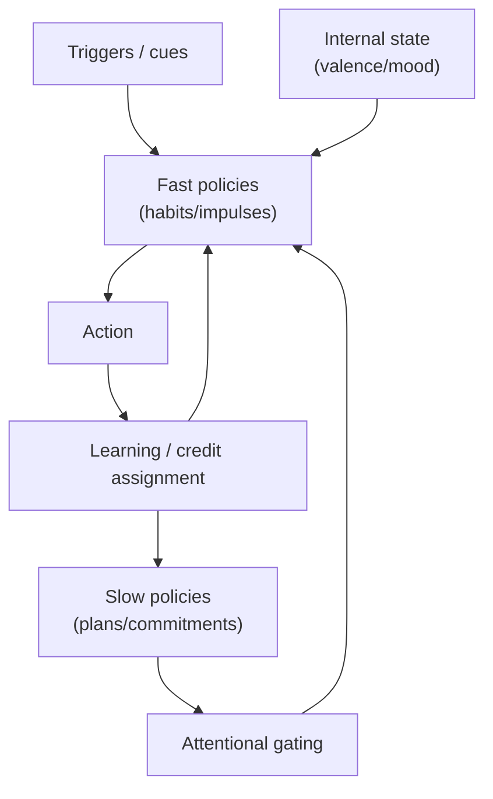

# Chapter 7: Self-Control and Failure Modes

## Motivation / puzzle
[BACH] If minds are control systems, why do they so often fail to control themselves? People know what they should do and do something else. They form intentions and then watch themselves violate them. The puzzle is not merely moral weakness; it is architectural: multiple control loops compete for the same actuators and learning signals. <!-- src: ccc_38c3_self_models_of_loving_grace @ 00:32:16 -->

[BACH] Self-control is a coordination problem inside the agent. A mind is not a single policy; it is a society of policies operating at different time scales with different training histories. <!-- src: ccc_38c3_self_models_of_loving_grace @ 00:32:16 -->

## Definitions introduced or refined
[BACH] <!-- src: ccc_38c3_self_models_of_loving_grace @ 00:32:16 -->
- Self-control: the capacity of the agent to coordinate internal policies to satisfy longer-horizon constraints.
- Habit: a cached policy that runs with minimal deliberation; efficient but often context-blind.
- Impulse: a fast policy triggered by salient cues and short-term valence.
- Addiction / reward capture: a failure mode where a subsystem hijacks the learning signal and dominates behavior.
- Compulsion: acting despite knowing better; the opposite of free will in the sense of being unable to execute the higher-level policy you endorse.
- Failure mode: a systematic breakdown of coherence between model, values, and action selection.

## Model (function + mechanism + phenomenology)
[BACH] Function: self-control is governance. A stable agent must allocate authority across time scales: fast loops handle immediate threats and opportunities; slow loops preserve long-term viability, reputation, and identity. Governance exists to prevent local optimizations from destroying global objectives. <!-- src: ccc_38c3_self_models_of_loving_grace @ 00:32:16 -->

[BACH] Mechanism: self-control can be implemented via hierarchical control and attentional gating. Higher-level models can bias which lower-level policies get executed, and they can restructure the environment to remove triggers (changing the input distribution). Crucially, self-control is not a single "willpower module"; it is a set of control policies about other control policies. <!-- src: ccc_38c3_self_models_of_loving_grace @ 00:32:16 -->

[BACH] Phenomenology: conflict feels like divided will because competing policies become simultaneously active. The system experiences a tension between action tendencies. When governance succeeds, the agent experiences coherence ("I meant to do this, and I did it"). When governance fails, the agent experiences alienation ("I watched myself do it again"). <!-- src: ccc_38c3_self_models_of_loving_grace @ 00:32:16 -->

### Free will as control capacity (and compulsion as its opposite)
[BACH] We will use "free will" in a deliberately deflationary, practical sense: free will is not opposed to determinism; it is opposed to compulsion. A person is free to the extent that they can act according to what they take to be right (their higher-order model, values, and commitments) rather than being dragged by a local loop they themselves disavow. <!-- src: ccc_35c3_10030_the_ghost_in_the_machine @ 00:36:40 -->

[BACH] This locates the free-will debate inside architecture. The relevant questions become: which loops have authority, how are commitments represented, how are short-term incentives prevented from capturing long-term policy, and what mechanisms allow the system to rewrite its own triggers and habits? <!-- src: ccc_35c3_10030_the_ghost_in_the_machine @ 00:36:40 -->

### The internal attack surface
[BACH] A mature agent is not only a controller of the external world; it becomes a controller of itself. This creates an internal attack surface. Any subsystem that can influence the reinforcement machinery can attempt to capture it. The result is not necessarily dramatic "wireheading"; it can appear as subtle rationalization, habitual loops, or persistent misallocation of attention. <!-- src: ccc_38c3_self_models_of_loving_grace @ 00:32:16 -->

[SYNTH] This is why governance is not an optional moral virtue. It is the functional requirement for keeping a learning system pointed at its own long-term objectives under internal adversarial pressure.

### Three levers that show up repeatedly
[SYNTH] In the control framing used here, most self-control interventions fall into a small set of levers:
- Environment: change the input distribution (remove triggers, add friction, add scaffolding).
- Attention: notice and reallocate processing resources before an impulse becomes an action.
- Commitment/identity: install constraints that persist across context (rules, promises, self-concept).

[SYNTH] The reason these levers recur is architectural. A mind does not directly choose actions from nowhere; it selects actions through competing policies that are activated by cues and modulated by value. If you change the cues, the competition changes. If you change attention, the arbitration changes. If you change commitments, the admissible policy set changes.

### Habits as compressed policies (why they are so sticky)
[BACH] A habit is not merely a repeated action. It is a compressed policy that runs cheaply. Habits exist because they save bandwidth: they bypass deliberation. Once installed, they are triggered by cues and reinforced by local reward. <!-- src: ccc_35c3_10030_the_ghost_in_the_machine @ 00:38:16 -->

[BACH] This explains both their power and their danger. Habits can make an agent highly competent in stable environments. But when context changes, the same compression becomes a bug: the habit continues to fire because the cue still matches, even though the long-horizon objective no longer does. <!-- src: yt_DYm7VBaEmHU @ 00:44:14 -->

[SYNTH] This is why many self-control strategies look like "change your life so you don't need willpower." In control terms: reduce the chance that the trigger-cue activates the wrong compressed policy.

### Commitments as training objectives
[BACH] A commitment can be understood as a deliberate training objective: "treat this constraint as binding even when it is locally costly." This is how long-horizon policies become learnable. If every moment is optimized for short-term comfort, the system never explores the policy space that yields long-term competence. <!-- src: ccc_35c3_10030_the_ghost_in_the_machine @ 00:30:38 -->

[SYNTH] This explains why commitments often need scaffolding. A naked verbal promise is a weak control signal. Commitments become stable when they are implemented across mechanisms: identity ("this is who I am"), environment (remove temptations), and social enforcement (reputation, contracts).

### Why self-control fails under context shift
[BACH] Many failures occur not because the agent lacks values but because the mapping from values to action is context-sensitive. A person can have a stable long-horizon goal ("be healthy") while the local cue environment repeatedly activates incompatible habits. The result feels like weakness, but it is often a predictable consequence of policy caching: the habit fires faster than deliberation can intervene. <!-- src: ccc_35c3_10030_the_ghost_in_the_machine @ 00:37:19 -->

[SYNTH] This suggests a diagnostic stance: before moralizing, ask which loop is winning, what cue triggers it, what reward reinforces it, and what governance mechanism failed to intervene.

## Worked example
[NOTE] The late-night scroll.

A short-term loop values immediate novelty and social cues. A long-term loop values sleep, health, and future competence. If the environment presents salient triggers (phone within reach, notifications), the fast policy can win repeatedly because it is trained on immediate reward and has low activation cost.

Self-control can succeed by:
- changing the environment (phone outside the room),
- changing attentional policies (noticing the trigger and shifting focus),
- changing commitments (a rule that binds behavior across contexts),
- changing values through learning (making long-term outcomes more salient now).

[NOTE] Procrastination.

Procrastination can be described as a short-horizon policy that reduces immediate discomfort by avoiding a task, even when the long-horizon model predicts higher cost later. The system is not "choosing badly" in a vacuum; it is resolving a local error signal (anxiety, boredom, uncertainty) with a cheap policy (delay) that is repeatedly reinforced by short-term relief.

In this framing, procrastination is best understood as a learning and governance problem: how to make the long-horizon cost salient enough now, and how to reduce the immediate aversive signal of the task so that a better policy becomes executable.

[NOTE] A third example: reward hacking as an internal attack surface.

If an agent can model its own reinforcement machinery, it can attempt to directly trigger "good" signals without doing the work those signals were meant to incentivize. In humans this can range from simple short-circuits (compulsive patterns) to sophisticated strategies (learning to reshape identifications, meditation practices, or systematic environmental design). In artificial agents, this shows up as reward hacking, wireheading, or specification gaming. The form differs; the pressure is the same.

[NOTE] A fourth example: addiction as local reward capture.

Addiction can be described as a failure mode where a short-horizon loop captures the reinforcement signal and becomes dominant. The agent learns a policy that produces immediate relief or pleasure, while long-horizon loops carry the cost later (health, social trust, identity collapse). This creates a characteristic phenomenology: the person can endorse one policy ("I should stop") while repeatedly executing another ("do it again").

The point is not to reduce addiction to a slogan. It is to show why moralizing is usually ineffective: the failure is not lack of knowledge; it is the architecture's inability to keep long-horizon commitments in control under strong short-term reinforcement.

## Predictions / implications
[SYNTH]
- Many "moral" failures are predictable architectural failures: misaligned learning signals, poorly designed commitments, and insufficient governance between time scales.
- Habits are neither good nor bad; they are efficient policies. They become dangerous when the world changes or when they capture reward.
- The most reliable self-control strategies often operate by shaping the input distribution (environment design) rather than relying on moment-to-moment deliberation.
- Commitments become stable when they are implemented across mechanisms (identity, environment, social enforcement), not when they remain mere intentions.

## Where people get confused
[NOTE]
- Treating self-control as a single inner entity ("the true self") fighting temptation. In this framework, the "self" is a model that coordinates competing policies; there is no extra homunculus.
- Treating habit as irrationality. Habits are rational under bandwidth constraints; they are compressed policies.
- Treating addiction as merely "wanting it too much". Reward capture is a learning failure mode: the signal shaping policy has been hijacked.
- Treating willpower as an unbounded resource. In a control framing, "willpower" names a bundle of mechanisms (attention, environment design, commitments), each with limits and failure modes.
- Treating procrastination as laziness. In this framing it is often a locally reinforced avoidance policy that wins under uncertainty or aversive task signals.

## Anchors (sources + timecodes)
- ccc_35c3_10030_the_ghost_in_the_machine @ 00:37:19 (keywords: function, reward, value)
- ccc_35c3_10030_the_ghost_in_the_machine @ 00:36:40 (keywords: free will, compulsion)
- ccc_35c3_10030_the_ghost_in_the_machine @ 00:30:38 (keywords: commitment, training, self-control)
- ccc_35c3_10030_the_ghost_in_the_machine @ 00:38:16 (keywords: reward function, reward hacking)
- yt_DYm7VBaEmHU @ 00:44:14 (keywords: agent, control, controller)
- ccc_38c3_self_models_of_loving_grace @ 00:32:16 (keywords: agent, control, control system)
- yt_3MkJEGE9GRY @ 00:01:33 (keywords: control, model)
- yt_3MkJEGE9GRY @ 00:10:29 (keywords: agent, control)
- ccc_37c3_12167_synthetic_sentience @ 00:32:49 (keywords: agent, control, control system)
- yt_skXe_cUucO8 @ 00:00:07 (keywords: control, controller)
- yt_skXe_cUucO8 @ 00:02:08 (keywords: agent, control, control system)

## Open questions / tensions
[OPEN]
- What is the most robust representation of commitments in a learning agent: explicit rules, identity-level constraints, or value-structure changes?
- How should governance allocate authority between fast and slow loops without creating paralysis?
- Which failure modes are unavoidable tradeoffs of limited bandwidth (and which are fixable by better architecture)?

## Takeaways
- Self-control is governance across internal policies and time scales.
- Habits are compressed policies; they trade flexibility for efficiency.
- Many failures are predictable outcomes of misaligned learning signals and weak internal governance.

## Bridge
We can now describe self-control as governance across policies and time scales, but we still cannot explain the construct that makes the agent a stable object to itself and to other agents. Next chapter: Self-Model and Narrative, where the self is treated as a model component and narrative as an interface.
