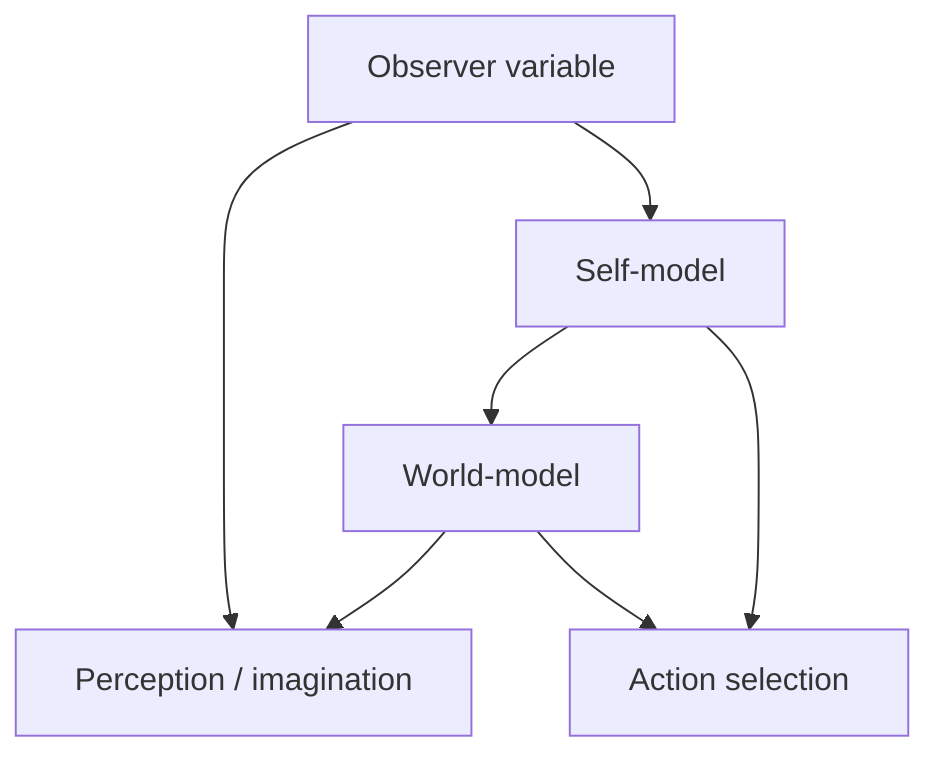

# Chapter 8: Self-Model and Narrative

## Motivation / puzzle
[BACH] Minds model the world, but human minds also model themselves. The puzzle is how a control system becomes a self for itself: how it constructs a first-person reference frame that stabilizes action, memory, and social coordination. <!-- src: yt_UkAOHrbcnAs @ 00:16:47 -->

[BACH] A common confusion is to treat the self as an entity behind experience. In this framework, the self is a representation: a model component that the system uses to predict and regulate its own behavior. The "I" is not a hidden homunculus; it is a control-relevant variable. <!-- src: yt_UkAOHrbcnAs @ 00:16:47 -->

[BACH] This also explains why the self can be both real and "not fundamental": real as implemented causal structure in the mind's model, and not fundamental in the sense that it does not appear as a primitive ingredient in physics. <!-- src: yt_UkAOHrbcnAs @ 00:16:47 -->

## Definitions introduced or refined
[BACH] <!-- src: yt_CcQMYNi9a2w @ 00:25:57 -->
- Self-model: a representation of the system as an agent within its own world-model.
- First-person perspective: the representational stance in which the self-model is used as the reference frame for perception and action.
- Narrative: a compressed account that organizes actions, intentions, and outcomes across time to support coherence and communication.
- Identity: the relatively stable constraints the self-model enforces ("what kind of system am I?").

## Model (function + mechanism + phenomenology)
[BACH] Function: the self-model exists because the system must predict itself. An agent is part of the world it models. If it cannot model its own limits, biases, and action tendencies, it cannot reliably control its future. The self-model also supports social cognition: other agents respond to a modeled self, and the agent must predict those responses. <!-- src: yt_CcQMYNi9a2w @ 00:25:57 -->

[BACH] Mechanism: self-modeling can be built from monitoring internal states, actions, and feedback. The system tracks what it did, what it intended, what it expects, and how others react. It then compresses these patterns into a stable self-representation that can be used for planning and communication. <!-- src: yt_UkAOHrbcnAs @ 00:16:47 -->

[BACH] Phenomenology: the first-person perspective is the experience of being located in a model. The system discovers itself in the act of observation: it experiences itself as the observer because the model includes an observer variable that stabilizes the modeling process. <!-- src: yt_UkAOHrbcnAs @ 00:16:47 -->

### Why the self-model is useful (and why it can mislead)
[BACH] A system that cannot model itself is blind to a significant part of the world: the part that consists of its own future actions. Self-modeling is therefore not vanity; it is prediction. If the system cannot represent its own limitations, biases, and competences, it cannot reliably plan. <!-- src: yt_UkAOHrbcnAs @ 00:16:47 -->

[BACH] This also explains why the self-model is not optimized for mechanistic truth. It is optimized for controllability and communicability. A self-model that is too fine-grained would be cognitively expensive; a self-model that is too honest about internal fragmentation might undermine coherence. The model trades fidelity for stability. <!-- src: yt_UkAOHrbcnAs @ 00:16:47 -->

[SYNTH] This is why introspection is simultaneously indispensable and unreliable. It reports real internal content (the self-model), but it does not directly reveal the mechanisms that produced that content. The model is the interface, not the wiring diagram.

### Identity as a control constraint
[BACH] Identity is the part of the self-model that persists as a constraint across time. It says which policies are admissible and which are not. This can be explicit ("I am a vegetarian") or implicit ("I don't do that kind of thing"). The effect is the same: identity changes the search space of actions. <!-- src: yt_UkAOHrbcnAs @ 00:16:47 -->

[BACH] This gives identity a functional role in self-control. If a commitment is only a plan, it can be overwritten by short-term valence. If it is part of identity, it gains stability because violating it now predicts costly future states: shame, loss of trust, loss of narrative coherence. <!-- src: yt_UkAOHrbcnAs @ 00:16:47 -->

### The social mirror
[SYNTH] In social environments, the self-model is shaped by other agents' models. People respond not to your neurons but to their model of you: your role, reputation, and commitments. Over time, the agent internalizes these expectations and incorporates them into identity. This is why shame and pride can feel intrinsic even when they are socially constructed: they are internalized governance signals.

[SYNTH] This also implies that "authenticity" is not a simple inner essence. It is a negotiation between multiple models: the agent's self-model, the models other agents hold, and the agent's model of those models. Coherence requires aligning these enough for predictable action.

### Narrative as compression for time and society
[BACH] Narrative is not merely entertainment or self-deception. It is a compression mechanism that makes long-horizon control possible. A narrative links events into causal arcs ("because I did X, Y happened") and links the agent into that arc ("I did X because I wanted Z"). This turns a stream of episodes into a policy-relevant structure. <!-- src: yt_CcQMYNi9a2w @ 00:25:57 -->

[BACH] Narrative also exists for communication. Other agents can coordinate with a story about you more easily than with a full mechanistic model. This is why narrative and identity are entangled: the narrative is the public API of the self-model. <!-- src: yt_CcQMYNi9a2w @ 00:25:57 -->

[SYNTH] The danger is over-trusting the API. Narratives can be coherent while being causally wrong. They often rationalize: they retrofit reasons to actions. In this framing, that is not a moral failing; it is the expected behavior of a compression mechanism under limited introspective access to mechanism.

### The self/world boundary is modeled, not given
[BACH] A self-model is, among other things, a model of boundaries: what is "me" and what is "not me"; what is under my control and what is not; which changes count as my actions and which count as external events. These boundaries are not given by physics. They are constructed because they make control possible. <!-- src: yt_UkAOHrbcnAs @ 00:16:47 -->

[BACH] This also explains why the self can feel more or less real. When the boundary model is stable and coherent, the self feels like an obvious fact. When the boundary model becomes unstable (sleep deprivation, altered states, certain pathologies), the self can feel unreal or fragmented. The phenomenology tracks the stability of the representational boundary. <!-- src: yt_UkAOHrbcnAs @ 00:16:47 -->

### Self-model failure modes
[SYNTH] If the self is a model, then self-related pathologies can be reinterpreted as model failures. Depersonalization can be framed as a weakening of the self/world boundary: the world remains present but "I" feels thin or unreal. Mania can be framed as a shift in priors about what is possible and what matters. Chronic shame can be framed as a self-model that predicts low social value regardless of evidence.

[SYNTH] The point of this reframing is not to replace clinical models. It is to keep the architecture consistent: treat the self as a control-relevant representation, and treat its distortions as distortions of representation rather than as metaphysical anomalies.

## Worked example
[NOTE] A person is driving to a time-sensitive meeting in city traffic.

- Self-model: "I am a careful driver" (or "I keep promises") becomes a constraint that shapes which policies feel available.
- Narrative: after a risky maneuver, the agent can produce a story ("I had to") that stabilizes identity even if the mechanism was reactive.
- Role switches appear as context shifts: driving alone vs with a child passenger activates different commitments and different self-descriptions.

## Predictions / implications
[SYNTH]
- Self-models can be useful while being inaccurate. They are optimized for control and social coherence, not for transparent mechanistic truth.
- Identity is a control constraint. Changes in identity change which policies are admissible and which commitments are stable.
- Narrative coherence is a functional requirement for long-horizon planning and social coordination, but it is not a guarantee of factual accuracy.
- Social roles shape self-modeling: the self is partly constructed from internalized expectations and reputational feedback.

## Where people get confused
[NOTE]
- Reifying the self-model into a metaphysical self. The model is the self, not a pointer to an extra entity.
- Confusing introspection with explanation. Introspection provides model content; explanation requires mechanism and function.
- Treating narrative as a record. Narratives are reconstructions that serve control and communication.
- Treating the self-model as optional. In social agents, some self-model is required for prediction, commitment, and coordination, even if its content can be revised.
- Treating the self-model as "the true you". In this framing, the self-model is a control interface: useful, revisable, and often biased toward coherence.

## Anchors (sources + timecodes)
- yt_UkAOHrbcnAs @ 00:16:47 (keywords: consciousness, model, self model)
- yt_UkAOHrbcnAs @ 01:12:48 (keywords: model, self model)
- ccc_38c3_self_models_of_loving_grace @ 00:01:14 (keywords: model, self-model)
- ccc_38c3_self_models_of_loving_grace @ 00:09:17 (keywords: consciousness, model, self-model)
- yt_3MkJEGE9GRY @ 00:24:13 (keywords: alignment, model, motivation, self model)
- yt_34VOI_oo-qM @ 00:12:50 (keywords: model, self model, simulation)
- yt_CcQMYNi9a2w @ 00:09:38 (keywords: model, self model)
- yt_CcQMYNi9a2w @ 00:25:57 (keywords: agent, model, self model)
- yt_CcQMYNi9a2w @ 01:59:34 (keywords: dream, self, virtual)
- ccc_35c3_10030_the_ghost_in_the_machine @ 00:36:40 (keywords: free will, compulsion)

## Open questions / tensions
[OPEN]
- What is the minimal self-model sufficient for a stable first-person perspective?
- Which parts of narrative are required for agency, and which are primarily social technology?
- How can a system revise identity without destabilizing all commitments?

## Takeaways
- The self is a model component used for self-prediction and governance.
- Narrative is compressed coherence for planning and communication, not a mechanism readout.
- First-person perspective is the experience of being located in a model via an observer variable.

## Bridge
We now have self-model and narrative as coherence and coordination tools, but we still cannot explain how limited bandwidth is allocated so the right contents become globally available for control. Next chapter: Attention and Workspace, where selection and a shared workspace become the coordination substrate.
