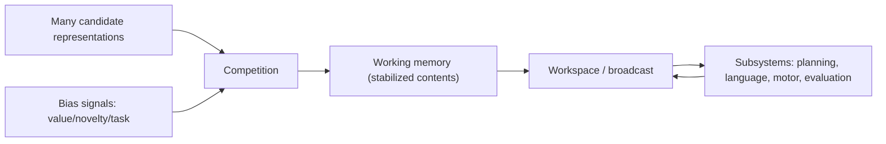

# Chapter 9: Attention and Workspace

## Motivation / puzzle
[BACH] Minds operate under bandwidth constraints. They cannot process everything they could represent. The puzzle is how a system remains coherent while most of what could be processed is ignored. Attention is the answer: the selection mechanism that allocates limited resources to a small subset of representations. <!-- src: yt_DYm7VBaEmHU @ 00:02:58 -->

[BACH] Attention is often conflated with consciousness. This chapter separates them. Attention is selection and resource allocation. Consciousness, as framed later, is a particular organization of how selected contents are integrated into a point of view. <!-- src: yt_UkAOHrbcnAs @ 00:19:11 -->

## Definitions introduced or refined
[BACH] <!-- src: yt_DYm7VBaEmHU @ 00:02:58 -->
- Attention: the allocation of limited processing resources to selected representations and policies.
- Salience: the pressure a representation exerts to capture attention (driven by novelty, valence, or urgency).
- Working memory: the temporary stabilization of selected representations for active control and reasoning.
- Workspace: a functional role that integrates and broadcasts selected contents so multiple subsystems can coordinate.

## Model (function + mechanism + phenomenology)
[BACH] Function: attention keeps the agent from fragmenting. It ensures that the same world-model is used across subsystems at the moment decisions are made. Without attention, a system can be locally competent yet globally incoherent: it contains many partial models that do not agree on what matters now. <!-- src: yt_DYm7VBaEmHU @ 00:02:58 -->

[BACH] Mechanism: attentional selection can be implemented as competition among representations modulated by bias signals (value, task demands, novelty). Working memory can be implemented as recurrent stabilization. A workspace can be implemented as a broadcast channel or integration hub, but the key is functional: selected content becomes available for cross-module coordination. <!-- src: yt_DYm7VBaEmHU @ 00:02:58 -->

[BACH] Phenomenology: attention feels like focus because it stabilizes a narrow slice of the model. When attention shifts, the felt world shifts: not because the world changed, but because the active model did. <!-- src: yt_UkAOHrbcnAs @ 00:19:11 -->

[BACH] A practical implication is that attention is never neutral. What wins access is partly shaped by valence and by learned priorities. In this sense, "salience" is not merely about signal strength; it is about what the agent's current control regime treats as urgent or informative. <!-- src: yt_DYm7VBaEmHU @ 00:02:58 -->

### Attention as internal governance
[BACH] In a layered control system, attention functions as a governance mechanism. It allocates the limited "budget" of processing to those representations that are currently relevant to control. In doing so, it suppresses other representations that may be locally compelling but globally unhelpful. <!-- src: yt_DYm7VBaEmHU @ 00:02:58 -->

[BACH] This helps explain why attentional failure looks like many different things: distractibility, tunnel vision, rumination, dissociation. In each case, the underlying functional problem is the same: the selection policy is not allocating resources in a way that serves the agent's current long-horizon constraints. <!-- src: yt_DYm7VBaEmHU @ 00:02:58 -->

### Attention is layered (task sets, not just spotlights)
[BACH] A useful way to think about attention is as multiple interacting selection policies. There is bottom-up capture (loud noise), top-down task focus (read this paragraph), and value-modulated bias (this is urgent). These layers can cooperate or fight. <!-- src: yt_DYm7VBaEmHU @ 00:02:58 -->

[SYNTH] This layered view explains why attentional control can fail even when a person "wants" to focus. The high-level intention is one bias signal among many. If competing bias signals are stronger (novelty, anxiety, social reward), the workspace will be pulled away. Self-control then becomes the problem of changing the bias landscape, not of shouting louder internally.

### Workspace as a coordination interface (not a place in the head)
[BACH] The workspace framing is useful as long as it is treated as a role, not a homunculus. A workspace is any mechanism that makes some content globally available so that multiple subsystems can coordinate on it: planning, language, motor control, emotional evaluation, and social modeling. <!-- src: yt_DYm7VBaEmHU @ 00:02:58 -->

[SYNTH] This makes an important prediction: if a system lacks a stable broadcast/integration channel, it can still contain many competent subsystems, but it will struggle to behave as one coherent agent under novel demands. Coherence requires a shared state.

### Attentional capture (why attention is politically and ethically relevant)
[BACH] Because attention is the bottleneck, it becomes an obvious target for capture. Any subsystem that can reliably steer attention can steer learning and action selection indirectly. This is true inside a mind (rumination, compulsion) and at the level of society (media ecosystems, incentive structures). <!-- src: yt_xthJ1R9Ifc0 @ 00:11:31 -->

[SYNTH] This is one bridge between cognitive architecture and culture. When an environment is optimized to hijack salience (through novelty, outrage, social reward), attentional policies drift. The agent can remain locally competent while becoming globally incoherent: it chases salience rather than its own long-horizon objectives.

[BACH] Working memory can be viewed as the stabilization mechanism that keeps selected content available long enough to be used for multi-step control. Without stabilization, the system can only react; it cannot hold intermediate state across time. This is why working memory capacity correlates with flexible reasoning: it is not a magical intelligence fluid, it is a control resource. <!-- src: yt_DYm7VBaEmHU @ 00:02:58 -->

[SYNTH] This also provides a simple explanation of why complex tasks feel effortful. Effort is the felt cost of keeping a representation active against competition. When attention must repeatedly re-stabilize the same content, the system experiences fatigue and distraction.

### Attention shapes what becomes valuable
[BACH] Attention is not only a consumer of value signals; it is a producer of future values. Because learning is selective, what the system attends to becomes what it learns, and what it learns becomes what it will later treat as salient. Attention therefore participates in building the agent's future objective landscape. <!-- src: yt_xthJ1R9Ifc0 @ 00:11:31 -->

[SYNTH] This creates feedback loops. If a system repeatedly attends to threat cues, it trains a threat-biased world-model. If it repeatedly attends to social reward, it trains status-sensitive values. If it repeatedly attends to slow, skill-building tasks, it trains competence. The environment, by shaping attention, is shaping the agent.

[BACH] This sets up the key distinction for the next chapter: attention is selection; consciousness is a particular way selected content becomes integrated into a point of view. Attention is necessary for coherent agency, but it is not, by itself, the whole story of being conscious. <!-- src: yt_UkAOHrbcnAs @ 00:19:11 -->

## Worked example
[NOTE] A person is driving to a time-sensitive meeting in city traffic.

- Attention selects a few cues into workspace (light state, lead car braking, pedestrian at curb) while suppressing irrelevant chatter.
- Workspace integration binds "late + wet road + yellow light" into one coherent control state instead of competing reflexes.
- Attentional capture (phone buzz, billboard, intrusive thought) is a control hazard: it steals workspace and degrades policy.

## Predictions / implications
[SYNTH]
- Attention modulates learning because only a fraction of experience is used for model updates. What the system attends to becomes what it learns.
- Under stress, attention often narrows; this can increase short-term control and reduce long-term flexibility.
- Systems can be highly capable yet unreliable if attentional policies are poorly aligned with goals and valence (for example, if novelty always wins).
- Attentional environments that optimize engagement can train attentional policies that reduce long-horizon agency (a slow form of reward capture).

## Where people get confused
[NOTE]
- Conflating attention with consciousness. Attention selects; consciousness (later) integrates into a point of view.
- Treating salience as a property of stimuli rather than as a property of the agent's control state.
- Treating the workspace as a literal place. It is a functional coordination role that can have multiple implementations.
- Treating attention as a single spotlight. In practice, attentional control can be layered and distributed across many competing processes.
- Treating attention as morally neutral. Attention is shaped by valence and learning, and it can be shaped by environments designed to capture it.

## Anchors (sources + timecodes)
- yt_DYm7VBaEmHU @ 00:02:58 (keywords: attention, global workspace, workspace)
- yt_xthJ1R9Ifc0 @ 00:24:08 (keywords: attention, global workspace, workspace)
- yt_34VOI_oo-qM @ 00:19:31 (keywords: global workspace, workspace)
- ccc_37c3_12167_synthetic_sentience @ 00:12:04 (keywords: global workspace, workspace)
- yt_UkAOHrbcnAs @ 00:19:11 (keywords: attention, consciousness, model)
- yt_xthJ1R9Ifc0 @ 00:11:31 (keywords: attention, consciousness, learning)
- yt_3MkJEGE9GRY @ 01:25:40 (keywords: attention, predict, prediction)
- yt_dW5uZLCm0Tg @ 02:10:37 (keywords: attention, social)

## Open questions / tensions
[OPEN]
- Which attentional mechanisms are necessary for flexible reasoning versus simple reactive competence?
- How much workspace capacity is required for stable self-modeling and long-horizon planning?
- What is the best way to describe attention without collapsing it into consciousness or into salience?

## Takeaways
- Attention is selection and resource allocation under bandwidth constraints.
- Working memory stabilizes selected content; a workspace integrates and broadcasts it.
- Attention shapes both what is experienced and what is learned.

## Bridge
We can now describe attention/workspace as the selection and integration interface of a bounded agent, but we still cannot state the specific organizational hypothesis that yields the phenomenology of presence and a stabilized point of view. Next chapter: Consciousness, where we treat consciousness as the coherence-inducing interface that stabilizes an observer and a present.
