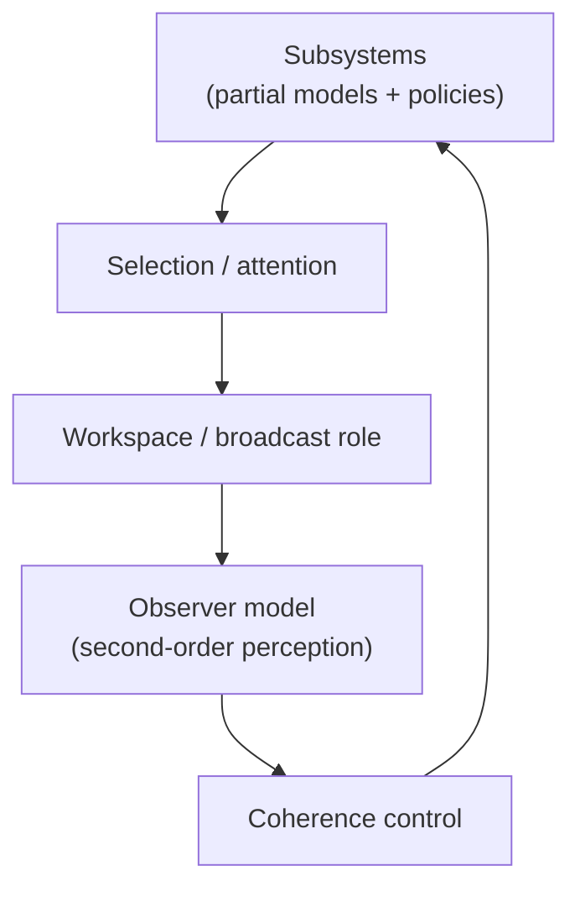

# Chapter 10: Consciousness

## Motivation / puzzle
[BACH] Consciousness is a gap in the scientific worldview. The hard problem, in one formulation, is the explanatory gap between mechanism and experience: why should any physical process feel like something from the inside? <!-- src: yt_CcQMYNi9a2w @ 01:58:03 -->

[BACH] A productive way to proceed is to refuse false choices. One can talk about consciousness from at least three perspectives: <!-- src: yt_xthJ1R9Ifc0 @ 00:08:46 -->
- Phenomenology: what it is like to experience, to be confronted with a "now", to have a first-person perspective.
- Mechanism: what the brain is doing when a system is awake, asleep, dreaming, attentive, or dissociated.
- Function: what consciousness does in the control architecture; how the system behaves differently when conscious processing is present.

[BACH] The thesis explored here is not that consciousness is a magical essence. It is that consciousness is a functional organization that stabilizes coherence and, in doing so, generates the characteristic phenomenology of presence and self. <!-- src: yt_CcQMYNi9a2w @ 01:58:03 -->

## Definitions introduced or refined
[BACH] <!-- src: yt_DYm7VBaEmHU @ 00:16:38 -->
- Consciousness: a functional organization that stabilizes and coordinates mental contents into a coherent point of view.
- Observer: a constructed reference frame that the system uses to stabilize perception and action; not a metaphysical entity.
- Second-order perception: perception of perception; the system models the fact that it is observing.
- Third-order perception: the system discovers itself as the observer within the act of observation; the self appears as a representation.
- Nowness: the modeled present; a coherence bubble in which the system's active contents are synchronized enough to be experienced as happening now.
- First-person perspective: a representational mode in which consciousness is projected into the self/world boundary; a content/state, not a substrate property.

## Model (function + mechanism + phenomenology)
[BACH] Function: consciousness acts like the conductor of a mental orchestra. Many subsystems produce partial interpretations and action tendencies. Conscious processing monitors them superficially, detects incoherence, and intervenes to restore global consistency. The output is a coherent agent rather than a bag of competing local behaviors. <!-- src: yt_CcQMYNi9a2w @ 01:58:03 -->

[BACH] The conductor metaphor is not merely poetic. It points at a functional asymmetry: most subsystems are specialists (vision, language, emotion, habit, planning). They can be locally competent while disagreeing about what is going on and what should happen next. Consciousness, in this framing, is the system that makes disagreement legible and negotiable at the level of the whole agent. <!-- src: yt_CcQMYNi9a2w @ 01:58:03 -->

[SYNTH] One way to make this functional claim testable (without pretending it is a benchmark) is to ask: what changes when conscious integration is present?
- Conflicts become representable: incompatible policies and interpretations can be compared rather than merely competed.
- Trade-offs become explicit: the system can negotiate between values and constraints that live in different subsystems.
- New coalitions become possible: a plan can recruit perception, language, and emotion into one coordinated trajectory.
- Errors become narratable: the system can form a reportable account of "what is going on" and "why this matters", which supports social coordination.

[SYNTH] None of these signatures uniquely define consciousness. They are functional pressures that any system must satisfy to behave like a coherent long-horizon agent. The proposal is that the organization that satisfies these pressures also yields the phenomenology of presence.

[BACH] Mechanism: this can be implemented by workspace-like integration that allows selected content to be broadcast and reconciled. The details matter, but the key is the stabilizing loop: the system maintains a model of an observer that integrates the model's contents and keeps the overall process coherent. <!-- src: yt_UkAOHrbcnAs @ 00:32:15 -->

[BACH] A workspace is not required to be a literal "place". It is the role of a mechanism that makes some contents globally available as inputs to many policies. This lets the system trade off constraints that no single subsystem could evaluate alone. <!-- src: yt_dW5uZLCm0Tg @ 00:41:09 -->

[BACH] Phenomenology: the feeling of "now" is the phenomenology of the observer model being stabilized in real time. The system is confronted with presentness because the observer variable is updated as part of the stabilization loop. The first-person perspective arises because the model includes a vantage point from which perception is organized. <!-- src: yt_DYm7VBaEmHU @ 00:16:38 -->

[BACH] Second-order perception can be read as a stabilizing trick: the system represents not only contents, but the fact that contents are being represented. This creates a self-referential loop that keeps the observing process from dissolving. "Nowness" is how this stabilization appears from the inside: the coherence bubble in which the model is currently being synchronized. <!-- src: yt_DYm7VBaEmHU @ 00:30:34 -->

[BACH] A recurring framing in recent talks is that consciousness can be understood as a model of attention (attention schema): a control model that tracks what is attended to and makes this state available for regulation and report. <!-- src: yt_UkAOHrbcnAs @ 00:19:13 -->

[SYNTH] This does not have to be treated as a single identity claim ("consciousness equals X"). It can be treated as a convergence region: global workspace, attention schema, and other frameworks highlight partially overlapping functional features.

[BACH] In this framing, the self is a fiction in the technical sense: a representational construct. It is a model of what it would be like if a unified entity existed behind behavior. The fiction is useful because it compresses control-relevant information and supports narrative coherence. It is not "false"; it is an instrument of control. <!-- src: yt_DYm7VBaEmHU @ 00:16:38 -->

[BACH] This is also why there is "no easy test" for consciousness. A Turing-test style evaluation deliberately ignores implementation. It asks only whether behavior looks intelligent in discourse. Consciousness, by contrast, is a hypothesis about internal organization: whether the system stabilizes an observer model that integrates and regulates its own modeling. <!-- src: yt_DYm7VBaEmHU @ 00:20:01 -->

### The dream within the dream (and why it matters)
[BACH] A recurring metaphor in the cited sources is that the experienced world is a generated model: a "dream of reality". Perception is the model being clamped by input; imagination is the model running freer. If that is correct, then consciousness is not just "having a dream". It is having a dream that includes the act of dreaming: a model in which the system represents itself as perceiving. <!-- src: yt_O5hymlaldf0 @ 00:01:58 -->

[BACH] This is one way to restate second-order perception. The system does not merely represent the world; it represents the fact that it is representing. This reflexive loop stabilizes the observer model and produces the characteristic phenomenology of presence. <!-- src: yt_DYm7VBaEmHU @ 00:30:34 -->

[BACH] For machine consciousness, this framing yields a crisp hypothesis: current AI can generate content that resembles dreams (high-resolution simulated worlds), but what may be missing is the "dream within the dream": the stabilized observer construction that makes the system relate to its own modeling as modeling. <!-- src: yt_O5hymlaldf0 @ 00:01:58 -->

### Third-order perception and the possibility of deconstruction
[BACH] A further step is sometimes described: the system discovers itself as the observer in the act of observation. The self becomes apparent as a representation. This yields the first-person perspective as a model state: "there is someone here, and it is me." <!-- src: yt_DYm7VBaEmHU @ 00:16:38 -->

[BACH] One can also move beyond this and deconstruct the observer: recognize the self-model as a useful fiction and reduce identification with it. This is linked to what meditators sometimes call enlightenment: not moral purity, but representational insight. <!-- src: yt_DYm7VBaEmHU @ 00:16:38 -->

[SYNTH] This is a delicate part of the framework. It is easy to turn into spiritual gloss. In the present framing it is strictly architectural: different self-model configurations yield different kinds of experience, stability, and suffering.

### Consciousness as a learning scaffold (genesis framing)
[BACH] In the machine consciousness hypothesis, consciousness is framed not as a late byproduct of complexity but as an early scaffold for learning. On this view, consciousness is the simplest way to train a self-organizing brain into becoming a human-like mind: it stabilizes perception and agency early, making structured learning possible. <!-- src: yt_O5hymlaldf0 @ 00:01:58 -->

[BACH] This reframes a common intuition. People often assume that consciousness appears only once the mind is already sophisticated. The genesis framing reverses the dependency: without consciousness, the system cannot reliably form the kind of structured world-model and self-model that later allow reason, language, and culture. <!-- src: yt_CcQMYNi9a2w @ 01:58:03 -->

### Suffering as dysregulation at the self/world boundary
[BACH] Suffering can be framed in control terms: conscious suffering happens at the boundary between world-model and self-model and indicates insufficient regulation. The proposed antidote is not suppression but better modeling and regulation: making the control problem explicit enough that the agent can decide what it cares about and how to act. <!-- src: yt_34VOI_oo-qM @ 00:45:15 -->

[SYNTH] This is not medical advice. It is a functional claim: if suffering is a particular failure mode of coherence and regulation, then interventions that improve modeling, attention, and value clarity should change the phenomenology.

### Reportability and language are interfaces, not definitions
[BACH] Because humans often access consciousness through verbal report ("I am conscious", "I feel X"), it is tempting to treat reportability as the definition. This framing resists that move. Language is one interface to conscious contents, but it is neither necessary nor sufficient for consciousness. A system can be conscious without being able to report, and a system can report without being conscious. <!-- src: yt_CcQMYNi9a2w @ 01:58:03 -->

[SYNTH] This matters for AI discourse. Conversational fluency and self-report are cheap to generate relative to building an architecture that maintains coherent self-relation across time. Treating self-report as evidence of consciousness encourages anthropomorphic over-attribution.

## Worked example
[NOTE] The epiphany.

A person struggles with a problem, then suddenly "sees" the solution. In a coherence framing:
- multiple subsystems produce incompatible partial models,
- attention brings them into a shared integration arena,
- conscious processing resolves the incoherence by constructing a new stable model,
- the phenomenology of insight is the subjective aspect of this stabilization.

[NOTE] The epiphany feels like a direct perception of truth, but it is also an internal reconfiguration: the model became coherent enough that the system can act and explain.

[NOTE] A second example: being conscious in a dream.

Consciousness is often associated with wakefulness, but in this framing it is associated with a particular organization of modeling and self-relation. A system can be conscious in dreams: it can inhabit a modeled world, even if that world is not constrained by current sensory input. This helps separate "consciousness" from "veridical perception".

It also motivates a separation between consciousness and first-person perspective: some conscious states may lack a stable first-person vantage ("looking from nowhere"), even though something is being experienced.

[NOTE] A third example: meditation as self-model reconfiguration.

In meditation practices, the agent often learns to observe the contents of experience without immediately identifying with them. In the present framing, this can be interpreted as changing the observer/self-model coupling: the system maintains perception-of-perception while weakening the narrative that says "this is happening to me". Phenomenologically, the world can remain vivid while the sense of self becomes thinner or more transparent.

This example matters because it makes deconstruction legible as architecture. It is not a metaphysical revelation; it is a change in representational stance and in governance of attention.

[NOTE] A fourth example: autopilot and dissociation.

People can perform complex behavior with minimal reportable awareness: driving a familiar route while thinking about something else, typing while planning a conversation, or acting out a practiced routine. In this framing, the agent is still controlling, but the control is executed by cached policies that do not require the full workspace/conductor loop. When something unexpected happens (a sudden hazard), attention snaps back and conscious integration reasserts itself.

## Predictions / implications
[SYNTH]
- No simple Turing test for consciousness: performance alone does not determine whether the system has the stabilizing observer organization. Consciousness is not merely a skill; it is a way of being organized.
- Consciousness and attention correlate but are not identical. Attention is selection; consciousness is the coherence-inducing integration that yields a point of view.
- If consciousness is a learning scaffold that appears early, then it may be prerequisite for becoming a human-like mind rather than a late byproduct of complexity.
- Machine consciousness becomes a hypothesis about architecture: whether conditions for self-organization and observer stabilization can be recreated on computers.

## Where people get confused
[NOTE]
- Equating consciousness with intelligence. A system can be capable without being conscious, and conscious without being particularly capable.
- Equating consciousness with language. Language is one interface to conscious contents, not the whole phenomenon.
- Treating the self as an entity behind experience. In this framework, the self is a model component.
- Collapsing phenomenology into mechanism or function. The three perspectives constrain each other but are not interchangeable.
- Treating self-report as decisive evidence. Systems can report consciousness without being conscious, and conscious systems can fail to report; the report channel is a mechanism that can dissociate from the phenomenon.
- Treating "it's all a model" as dismissive. In this framing, the model is what you live in; calling it a model does not make it unreal.

## Anchors (sources + timecodes)
- yt_DYm7VBaEmHU @ 00:30:34 (keywords: consciousness, second-order perception)
- yt_DYm7VBaEmHU @ 00:19:20 (keywords: consciousness, observer)
- yt_DYm7VBaEmHU @ 00:16:38 (keywords: third-order perception, self, observer)
- yt_DYm7VBaEmHU @ 00:18:17 (keywords: consciousness, learning algorithm, infancy)
- yt_DYm7VBaEmHU @ 00:20:01 (keywords: consciousness, Turing test)
- yt_UkAOHrbcnAs @ 00:19:13 (keywords: consciousness, attention, attention schema)
- yt_UkAOHrbcnAs @ 00:32:15 (keywords: experience, model, observer)
- yt_xthJ1R9Ifc0 @ 00:08:46 (keywords: consciousness, dream, first-person perspective)
- yt_O5hymlaldf0 @ 00:01:58 (keywords: dream within dream, perception of perception, machine consciousness)
- yt_CcQMYNi9a2w @ 01:58:03 (keywords: agent, consciousness, experience, function, language)
- yt_pB-pwXU0I4M @ 00:33:56 (keywords: consciousness, experience, predict)
- yt_b6oekXIQ-LM @ 00:19:59 (keywords: consciousness, experience)
- yt_mofeg5Focxs @ 00:00:46 (keywords: consciousness, experience)
- yt_34VOI_oo-qM @ 00:19:16 (keywords: consciousness, coherence, conductor, nowness)
- yt_34VOI_oo-qM @ 00:15:15 (keywords: enlightenment, representation, deconstruction)
- yt_34VOI_oo-qM @ 00:45:15 (keywords: suffering, regulation, self-model)
- yt_dW5uZLCm0Tg @ 00:41:09 (keywords: global workspace, attention schema, coherence)
- ccc_38c3_self_models_of_loving_grace @ 00:10:34 (keywords: conductor, coherence)
- yt_DYm7VBaEmHU @ 00:11:02 (keywords: scientific worldview, spirit, animism)

## Open questions / tensions
[OPEN]
- Which functional features are sufficient for the phenomenology of presentness?
- How much observer construction is required for consciousness, and how much is required only for reportable selfhood?
- If consciousness is an early learning scaffold, what is its minimal implementation in an artificial system?

## Takeaways
- Consciousness is treated as a coherence-inducing organization that stabilizes a point of view.
- The self is a representational construct: useful, real as implemented, not metaphysically fundamental.
- The hard problem is addressed by disciplined triangulation: phenomenology, mechanism, function.

## Bridge
We now have a functional framing of consciousness, but we still cannot complete the picture without the social layer where models are coordinated across agents by language, norms, and culture. Next chapter: Social Minds, Language, Culture, where multi-agent coordination becomes part of the architecture.
