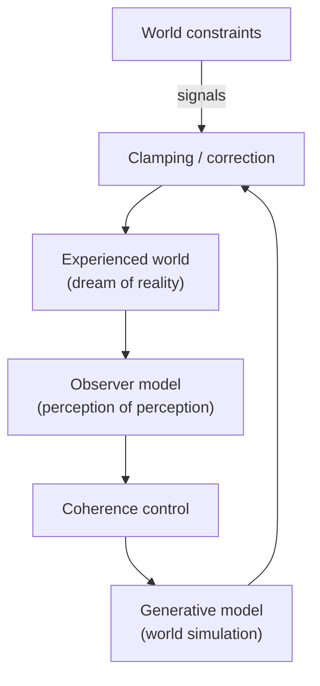

# Chapter 13: Machine Dreams and Virtualism (Reality as a Model)

## Motivation / puzzle
[BACH] A deliberately provocative metaphor used in the cited sources is that the world we experience is a "dream". This is not a claim that the external world does not exist. It is a claim about how the mind relates to the external world. The mind does not experience physics directly; it experiences a constructed model that is constrained by physics. <!-- src: ccc_37c3_12167_synthetic_sentience @ 00:17:39 -->

[BACH] The puzzle is why this metaphor is useful rather than merely poetic. If the experienced world is a generated model, then many old confusions become engineering questions: what is being generated, what constrains it, what stabilizes it, and what makes it coherent enough to be lived in? <!-- src: ccc_35c3_10030_the_ghost_in_the_machine @ 00:04:02 -->

## Definitions introduced or refined
[BACH] <!-- src: yt_b6oekXIQ-LM @ 00:00:21 -->
- Dream (technical usage): generated model content that is experienced as a world; varying by how strongly it is constrained by sensory input.
- Virtual: real as implemented causal structure at a level of abstraction, even if not fundamental in physics.
- Virtualism: a perspective in which consciousness (and the experienced world) is treated as a simulation in an information-processing substrate.
- Simulator: a runnable model that can generate counterfactual trajectories.
- Constraint: an input or boundary condition that clamps the model (as perception clamps imagination).

## Model (function + mechanism + phenomenology)
[BACH] Function: the mind exists to control the future. To control, it must model. A model that is good enough for control does not need to be a perfect copy; it needs to preserve invariances that matter for action. <!-- src: yt_FMfA6i60WDA @ 00:02:59 -->

[BACH] Mechanism: the same kind of machinery that can generate dreams at night can generate perception during the day. The difference is not the existence of "a simulation module" versus "a perception module". The difference is constraint. In waking perception, the model is continuously corrected by sensory input. In dreaming and imagination, the model runs freer. <!-- src: ccc_37c3_12167_synthetic_sentience @ 00:17:39 -->

[SYNTH] One further interpretation is that dreaming is offline simulation: the model is allowed to explore trajectories that are normally suppressed by sensory correction. This can reveal inconsistencies, rehearse policies, and consolidate memory. Even if the details differ, the architectural point remains: a system that can simulate can use simulation both for planning (daydreaming) and for reorganization (sleep dreaming).

[BACH] Phenomenology: this is why the world can feel immediately real. Realness is the stability of the interpretation. When the model is coherent enough to support action, the world is present. When coherence breaks, the world becomes strange: unreal, fragmented, or inconsistent. <!-- src: ccc_37c3_12167_synthetic_sentience @ 00:17:39 -->

### Illusion and hallucination as model failure modes
[BACH] If experience is model content under constraint, then illusion and hallucination stop being exotic. An illusion is a case where the model settles on an interpretation that is locally coherent but mismatched to the external cause, often because the input is ambiguous and priors dominate. A hallucination is a case where internally generated content is insufficiently clamped by input. <!-- src: ccc_35c3_10030_the_ghost_in_the_machine @ 00:04:02 -->

[SYNTH] This framing is useful because it keeps the story architectural. The model is doing what it always does: completing a world under constraints. The failure mode is a shift in relative weighting: too little constraint, or priors that are miscalibrated.

### Virtual objects are real (at the right level)
[BACH] The dream metaphor is often misread as nihilism ("nothing is real"). The intended point is closer to software realism. A Minecraft world is not visible under a microscope, but it is real as implemented causal structure. Likewise, the objects of experience are real as model-objects: stable roles that the control system uses. <!-- src: ccc_37c3_12167_synthetic_sentience @ 00:17:39 -->

[SYNTH] This is why "virtual" should not be taken as "fake". Virtuality is a claim about level of description. A map is virtual relative to the territory, but it is real as an artifact and as a control instrument.

### Virtualism is not dualism
[BACH] Virtualism is sometimes misread as a return to old dualisms ("mind is separate from body"). The intended move is the opposite. Virtualism is a monist stance: the mind is implemented by physical processes, but the entities of experience are described at a virtual level. The mind is not outside physics; it is a pattern in physics. <!-- src: yt_b6oekXIQ-LM @ 00:19:53 -->

[SYNTH] In that sense, "virtual" plays the same role for mind that "software" plays for computers. Software is not a ghost substance; it is a level of organization that is real as causal structure. Virtualism is the claim that consciousness belongs on that side of the ledger.

### Virtualism: consciousness as simulation
[BACH] We will use "virtualism" to name the stance that consciousness is not a fundamental physical property but a simulation in a representational substrate (matching usage in the cited source). Consciousness, on this view, is as real as other virtual objects: it is implemented as causal structure in information processing. <!-- src: yt_b6oekXIQ-LM @ 00:19:53 -->

[BACH] This stance has two practical implications. First, it treats the hard problem as an architectural challenge: identify the organization that yields the phenomenology. Second, it makes machine consciousness an empirical question: if the organization can be implemented, the phenomenon can, in principle, exist on other substrates. <!-- src: yt_b6oekXIQ-LM @ 00:00:21 -->

### Machine dreams and the missing ingredient
[BACH] Modern generative AI systems can produce "dreams" in the sense of rich generated content: images, videos, text-worlds, simulated characters. This makes the metaphor newly concrete. It is no longer speculative that machines can generate world-like content. <!-- src: ccc_35c3_10030_the_ghost_in_the_machine @ 00:04:02 -->

[BACH] But the machine consciousness hypothesis predicts that something crucial may still be missing: the "dream within the dream": a stabilized model of the act of perceiving. The system may generate content, but not generate the observer that is confronted with it as "now" and "me". In this framing, that missing ingredient is what would turn a dream into conscious experience. <!-- src: yt_O5hymlaldf0 @ 00:01:58 -->

### Why simulators matter (not just classifiers)
[BACH] A recurring contrast is drawn between systems that classify patterns and systems that simulate worlds. A classifier can label a stimulus; a simulator can generate a coherent environment that supports counterfactual action. Minds, in this framing, are not piles of independent classifiers. They are unified simulators that maintain a world-model in which many different inferences and policies can be coordinated. <!-- src: yt_FMfA6i60WDA @ 00:02:59 -->

[SYNTH] This is one way to interpret why "machine dreaming" is a plausible route toward richer AI. As models become better at simulating environments (physical, social, conceptual), they move from labeling to constructing. The remaining question is whether they also implement the observer-stabilization loop that yields a point of view.

## Worked example
[NOTE] A person is driving to a time-sensitive meeting in city traffic.

- The driver's "reality" is already virtual in the technical sense: a model constrained by sensors, not direct access to physics.
- Planning a detour is running a simulator: the agent rolls out counterfactual futures ("if I take side streets, will I make it?") under uncertainty.
- When constraint weakens (daydreaming, fatigue), the model can drift—an everyday analogue of dream-like generation and hallucination-like error.

## Predictions / implications
[SYNTH]
- Many debates about "reality" become debates about levels of description: what is implemented as stable causal structure in the control system?
- If perception and imagination differ by constraint, then hallucination and illusion are not alien phenomena; they are natural failure modes of inference under ambiguity or weak clamping.
- Generative AI will increasingly look like "machine dreaming" as models become better simulators; whether this becomes consciousness depends on whether the architecture includes a stabilized observer loop.

## Where people get confused
[NOTE]
- Reading the dream metaphor as solipsism. The claim is representational: experience is model content constrained by the world, not denial of the world.
- Conflating simulation with deception. A simulation can be true as a model even when it is not the territory.
- Treating "virtual" as "not real". Virtual objects can be real at the level of implemented causal structure.
- Treating LLM-generated characters as proof of minds. Simulation of an agent can be a stand-in for agency without implying underlying self-organized agency.

## Anchors (sources + timecodes)
- ccc_35c3_10030_the_ghost_in_the_machine @ 00:04:02 (keywords: dream, world-model, generated reality)
- ccc_37c3_12167_synthetic_sentience @ 00:17:39 (keywords: dream, reality, inside model)
- yt_b6oekXIQ-LM @ 00:00:21 (keywords: virtualism, perspective, consciousness)
- yt_b6oekXIQ-LM @ 00:19:53 (keywords: virtualism, consciousness, physical)
- yt_O5hymlaldf0 @ 00:01:58 (keywords: dream within dream, observer)
- yt_FMfA6i60WDA @ 00:02:59 (keywords: unified model, not classifiers)
- yt_CcQMYNi9a2w @ 01:59:34 (keywords: dream, self, virtual)

## Open questions / tensions
[OPEN]
- What is the minimal constraint structure that yields stable "realness" without a self-model?
- Can a system generate a stable observer model without having a body, or is sensorimotor coupling required?
- How should one test the presence of an observer-stabilization loop in an artificial system?

## Takeaways
- The "dream" metaphor is about representation: experience is generated model content constrained by the world.
- Virtual objects can be real as implemented causal structure at the right level of description.
- Virtualism treats consciousness as simulation in an information-processing substrate, not as a fundamental substance.
- Generative AI can produce "dream content"; consciousness would require the "dream within the dream" (observer stabilization).

## Bridge
We now have virtualism and the “dream machinery” as a model-level account of experience, but we still need to compress the whole stack into what it buys you and what remains open. Next chapter: Conclusion, where we summarize the leverage and the remaining architectural questions.
